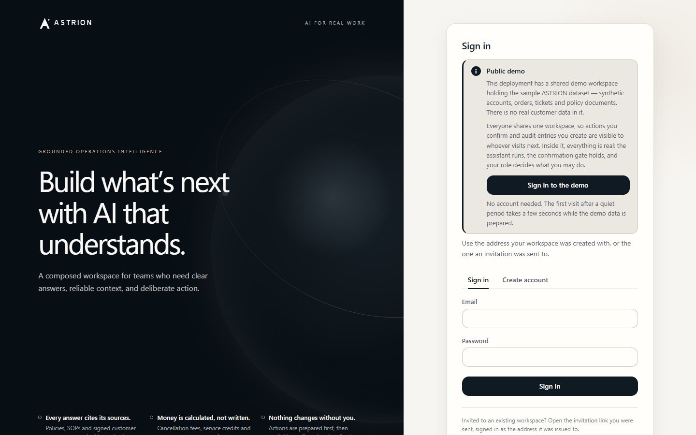
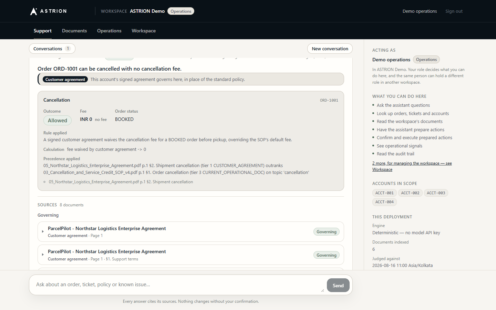
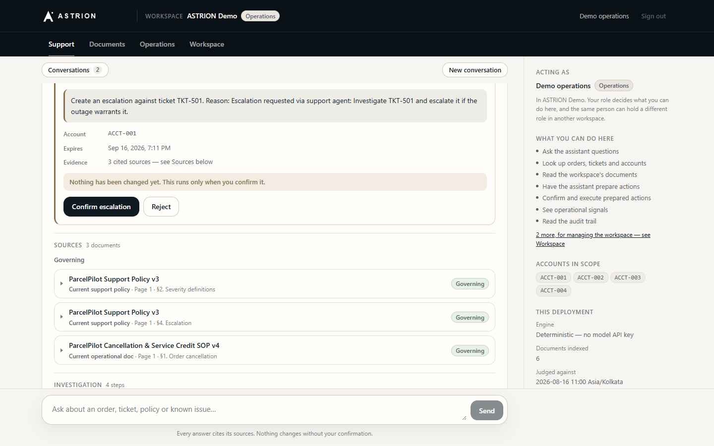
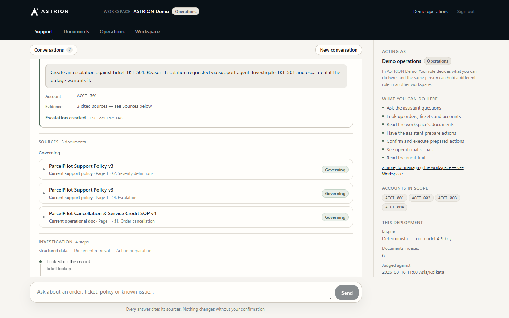
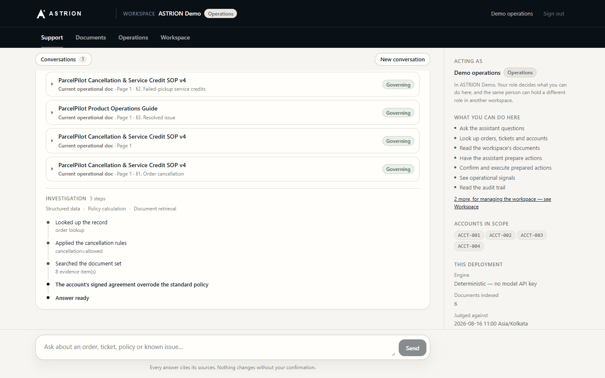
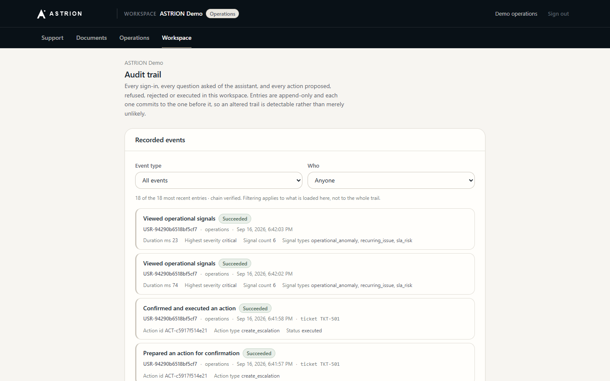
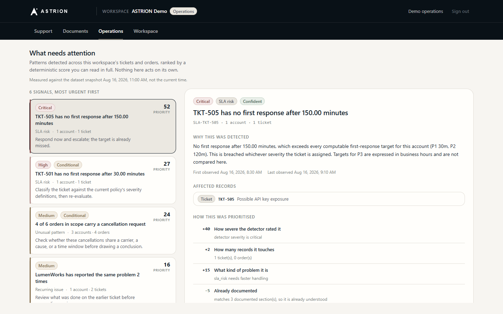
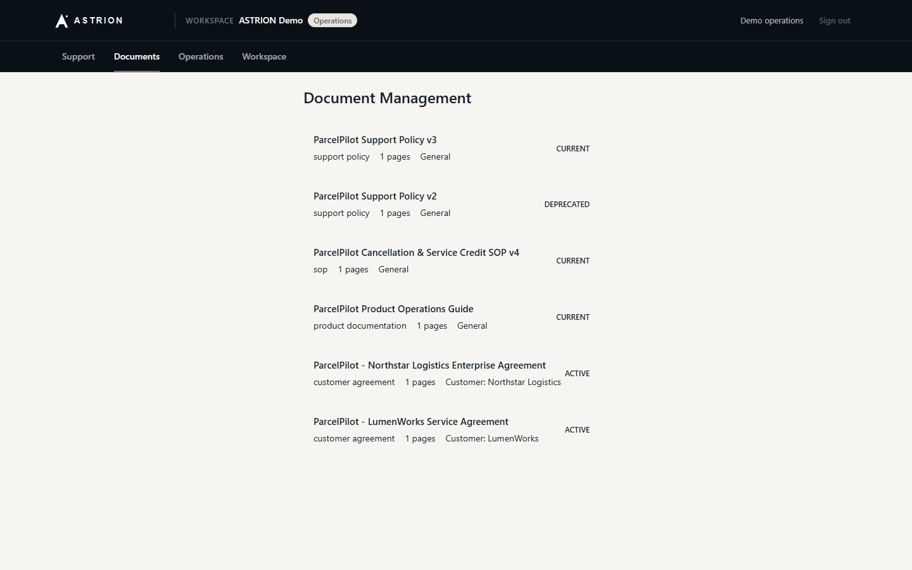

# ASTRION

**An AI support and operations agent for a logistics platform that looks
everything up, lets deterministic code make the decisions, and changes nothing
without a person's explicit confirmation.**

Support teams answer questions like *"Can this customer cancel without a fee?"*
or *"Is this late pickup eligible for a credit?"* by reading a support policy,
an SOP, a product guide, sometimes a signed customer agreement that overrides
all of them, and then the customer's actual orders and tickets. A chatbot that
summarises those documents will eventually quote the deprecated policy, miss
the contract override, or promise a credit nobody authorised. ASTRION is built
so that it cannot: retrieval ranks sources by authority, policy arithmetic is
code rather than generated text, every answer shows its evidence and its
confidence, and every state change stops at a confirmation gate.

## Live demo

**<https://astrion-app.vercel.app/>** — press **Sign in to the demo**. No
account, no email, no password.

You enter a shared workspace, **ASTRION Demo**, as its **operations** member:
you can ask the agent anything, have it prepare an action, confirm that action
yourself, and read the resulting audit trail. All data is the synthetic
ParcelPilot assessment pack — six policy documents and a structured snapshot of
accounts, orders and tickets. There is no real customer data anywhere.

The API sleeps when idle, so the first visit can take a few seconds while the
backend wakes and, if its disk was recycled, rebuilds the demo database from
the source pack by itself.

Try:

- *Can Northstar cancel ORD-1001 without a cancellation fee? Explain why.* — a
  signed agreement overrides the SOP, and the answer says so.
- *Is ORD-2002 eligible for a failed pickup service credit?* — a calculated
  INR 300 credit under the LumenWorks agreement.
- *Investigate TKT-501 and escalate it if the outage warrants it.* — a prepared
  escalation you then confirm or reject.
- *What is the weather in Mumbai today?* — no evidence, reported as *Not enough
  information* rather than guessed.

| | |
| --- | --- |
|  |  |
| **One click in.** The credential never reaches the browser. | **The contract wins, visibly.** Outcome, rule, calculation and the precedence decision. |
|  |  |
| **Prepared, not performed.** Nothing has changed yet. | **Confirmed, executed, receipted.** |
|  |  |
| **What the agent actually did**, step by step. | **A hash-chained audit trail** the visitor can read. |
|  |  |
| **What needs attention**, ranked by a score you can read in full. | **The source pack**, with each document's stated status. |

## What ASTRION demonstrates

- **Multi-step agentic investigation** — the agent chains record lookups,
  policy evaluation, document retrieval and action preparation, and shows each
  step it took.
- **A deterministic decision layer** — cancellation fees, service credits and
  SLA targets are computed by the policy engine, never written by the model.
- **Authority-ranked document retrieval** — sources are ranked by what they are
  (signed agreement, current policy, current operational doc, deprecated),
  not only by how well they match.
- **Structured data tools** — accounts, orders and tickets from a SQLite
  snapshot, with record-level provenance back to the source workbook.
- **Customer-agreement precedence** — a signed contract overrides the general
  policy for that account only, and the answer records the override.
- **Tenant-scoped access control** — workspaces, memberships and five roles;
  data scoping is compiled into the SQL, not filtered after the fact.
- **Confirmation-gated actions** — escalations and service credits are
  proposed by the agent and executed only by an explicit, fingerprinted,
  single-use confirmation, with a manager-approval threshold.
- **Trust and uncertainty handling** — every answer carries a trust status
  (confident, conditional, insufficient data, conflict, escalate) separate
  from its outcome.
- **Proactive operations intelligence** — SLA risk, recurring and
  cross-customer issues and unusual patterns, detected by explainable rules.
- **A self-healing public demo** — the backend rebuilds its own database,
  document index and demo workspace after a cold start, idempotently.

## Architecture

```text
 Browser (Next.js)  ── session cookie ──▶  FastAPI
                                             │
                          ┌──────────────────┴──────────────────┐
                          │  Authentication + workspace scoping  │
                          │  (who is asking, which accounts)     │
                          └──────────────────┬──────────────────┘
                                             │  AgentContext
                                             ▼
                                   Agent orchestrator
                          (deterministic planner, or an LLM planner)
               ┌───────────────┬─────────────┴──────┬──────────────────┐
               ▼               ▼                    ▼                  ▼
      Document retrieval  Structured data   Deterministic policy   Action preparation
      authority-ranked    accounts, orders, cancellation, credits,  escalation, credit,
      search + evidence   tickets, provenance SLA targets           ticket note
               └───────────────┴─────────────┬──────┴──────────────────┘
                                             ▼
                                Trust assessment + composer
                     (outcome, trust status, governing authority, sources)
                                             │
                        proposal ────────────┘
                           │
                           ▼
          POST /api/actions/{id}/confirm   ← a separate request, never the chat
          permission · workspace scope · session · expiry · fingerprint
          · manager threshold · single use
                           │
                           ▼
                  Execution + hash-chained audit log
```

Every tool call runs under the caller's `AgentContext`. The account scope is
decided before the message is read, and nothing in the message can widen it —
a record outside the scope is *not found*, not *forbidden*.

## Core engineering decisions

1. **LLM reasoning is separated from policy decisions.** The model (or the
   deterministic planner) chooses tools and explains results. Fees, credits,
   eligibility and SLA targets come from `app/backend/policies/`, so the same
   inputs always produce the same verdict.
2. **Signed customer agreements outrank general policy.** Authority is derived
   from each document's own stated type and status at ingestion: tier 1
   customer agreement, tier 2 current support policy, tier 3 current
   operational documentation, tier 4 non-authoritative.
3. **Deprecated material cannot silently govern.** A deprecated policy is
   structurally non-authoritative whatever it matches; it can appear as
   context, labelled as such, and never decides an answer.
4. **Authorization is enforced at the data and tool layer.** Roles resolve
   through one permission matrix, workspace account scope is compiled into
   queries, and the model has no parameter that could widen either.
5. **State-changing actions require explicit confirmation.** `/api/chat` has
   no path to execution. Confirmation is a separate API call with a closed
   vocabulary that re-validates everything and runs at most once.
6. **Trust is separate from outcome.** "Answered" and "confident" are
   different claims. An answer can be complete and conditional, and an
   investigation that found nothing is reported as insufficient data.
7. **The demo bootstrap is idempotent and self-healing.** Readiness is read
   from the database on every demo sign-in, never remembered in memory; only
   missing pieces are rebuilt, and concurrent cold starts converge on one
   environment.

The full design, including the reasoning behind each decision, is in
[docs/architecture.md](docs/architecture.md).

## Product areas

- **Support** — the chat. Each answer shows its outcome, trust status,
  structured decision card, sources (governing and contextual), the
  investigation steps, and any prepared action with Confirm and Reject.
- **Documents** — the source pack as the agent sees it: type, status, customer,
  page count and the extracted section chunks. Workspace owners and admins can
  upload customer agreements for their own accounts.
- **Operations** — what needs attention now: ranked signals with an itemised,
  deterministic priority score and the records behind each one.
- **Workspace** — members, roles, invitations and the audit trail. The
  header always states the active workspace and your role in it.

## Data source

The system is grounded entirely in the supplied ParcelPilot assessment pack,
committed unmodified under [`data/source/`](data/source/README.md):

| Document | Status | Role |
| --- | --- | --- |
| Support Policy v3 | current | general support terms and severity targets |
| Support Policy v2 | deprecated | retained to prove it is never used as current |
| Cancellation & Service Credit SOP v4 | current | fees, credits, approval threshold |
| Product Operations Guide & Known Issues | current | plan capabilities, known issues such as KI-211 |
| Northstar Logistics Enterprise Agreement | active | overrides for ACCT-001 |
| LumenWorks Service Agreement | active | overrides for ACCT-002 |

Plus `ParcelPilot_Assessment_Data.xlsx`: accounts, orders and tickets as of a
fixed snapshot, **2026-08-16 11:00 Asia/Kolkata**. Every time-based judgement
is measured against that snapshot, not against today.

## Security

- Real authentication: scrypt password hashes, server-side sessions in
  `HttpOnly; Secure` cookies, account lockout, per-route rate limits, optional
  TOTP.
- Workspaces with owner, admin, operations, support and viewer roles; every
  permission check reads one matrix, and records outside a caller's workspace
  answer 404.
- The one-click demo endpoint takes no input and signs in through the ordinary
  login path with a backend-held credential that no response, log line or
  frontend file contains.
- Uploaded documents must belong to the uploader's own accounts; the supplied
  source pack cannot be deleted through the API.
- Strict CSP and security headers, an Origin check on state-changing requests,
  a CORS allow-list with no wildcard, and a tamper-evident audit log.
- Prompt injection cannot widen scope or execute anything: identity, scope and
  execution are all decided outside the model.

Details, the threat model and known limitations:
[docs/SECURITY.md](docs/SECURITY.md).

## Testing

| Suite | Result |
| --- | --- |
| Backend (pytest) | **1160 passed** |
| Frontend (Vitest) | **247 passed** (18 files) |
| TypeScript | `tsc --noEmit` clean |
| Production build | `next build` clean |
| Dependencies | `pip-audit`: no known vulnerabilities |

The backend suite includes a dedicated agent evaluation over the real source
pack, adversarial tenant-isolation tests, confirmation-gate and replay tests,
and the self-healing demo under concurrent cold starts. The frontend tests
render responses recorded from the real backend, so the UI is tested against
the contract the API actually serves. No test needs an API key.

## Repository structure

```text
app/
  backend/
    agent/        orchestrator, planners, composer, trust assessment
    api/          FastAPI routes, schemas, middleware, auth endpoints
    auth/         users, sessions, workspaces, roles and permissions
    policies/     deterministic cancellation, service-credit and SLA rules
    retrieval/    PDF extraction, authority tiers, ranked search
    tools/        the agent's tools and their registry
    operations/   proactive signal detection and ranking
    services/     database, records, documents, actions, audit, demo bootstrap
  frontend/       Next.js app: Support, Documents, Operations, Workspace
data/source/      the supplied assessment pack (the only input)
scripts/          ingestion, source verification, demo seeding, contract export
tests/            pytest suite
docs/             architecture, security, product, reference, screenshots
```

## Documentation

- [Architecture](docs/architecture.md) — the full technical design.
- [Security](docs/SECURITY.md) — threat model, controls and limitations.
- [Product note](docs/product.md) — problem, users, trust, actions, next steps
  and the success metric.
- [Demo script](docs/demo-script.md) — the five-minute walkthrough.
- [Submission checklist](docs/submission-checklist.md) — what is verified and
  what remains.
- [Engineering reference](docs/reference.md) — detailed setup, deployment,
  API, environment variables and the build history.
- [Future plan](docs/FuturePlan.md) — what would come next, in order.

## Development

Python 3.13 and Node.js 24. No API key or network is needed; the deterministic
planner is the default.

```powershell
py -3.13 -m venv .venv; .venv\Scripts\Activate.ps1
pip install -r requirements.txt
cd app/frontend; npm install; cd ../..
python dev.py
```

`dev.py` starts the API on <http://127.0.0.1:8000> and the UI on
<http://localhost:3000>. Open the UI and press **Sign in to the demo**; the
database, document index and demo workspace are built on first use.

```powershell
python -m pytest -q                         # backend
cd app/frontend; npm test; npm run typecheck; npm run build
```

To run the agent on a real model, set `LLM_PROVIDER=real` and
`OPENAI_API_KEY`. Every other setting is documented in
[`.env.example`](.env.example) and the
[engineering reference](docs/reference.md).

## Limitations

- **Synthetic, shared demo.** Everyone uses one workspace, so actions and audit
  entries one visitor creates are visible to the next.
- **Ephemeral hosted storage.** The hosted API runs on a free tier whose disk
  does not persist: after a restart the demo rebuilds itself, and earlier
  actions, uploads, sessions and audit entries are gone. Keeping them needs a
  persistent disk or an external database.
- **Deterministic hosted answers.** The live demo runs without a model, so
  answers are reproducible and free to serve; questions answered purely from
  documents are returned as cited sections rather than composed prose.
- **The demo identity is operations, not a manager.** It can confirm ordinary
  actions but not a credit above the SOP's manager threshold. With the supplied
  data every eligible credit is below that threshold.
- **Self-registration cannot complete on the hosted deployment**, which has no
  mail transport; the demo is the way in.
- **Uploads are capped by the global request size limit** (256 KB), which the
  supplied documents fit comfortably within.
