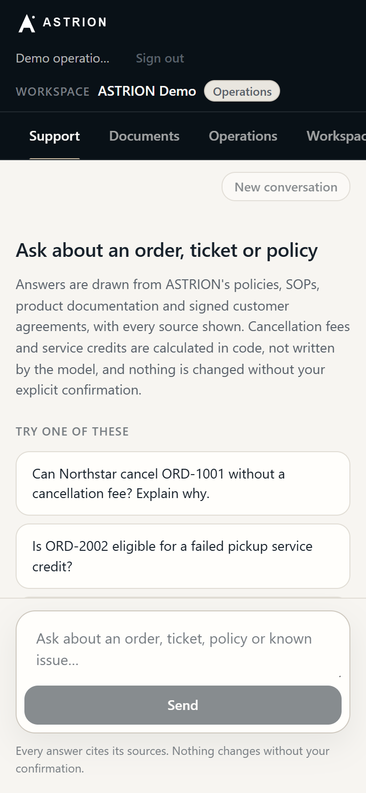

# ASTRION

**An AI support and operations agent for a logistics platform that looks
everything up, lets deterministic code make the decisions, and changes nothing
without a person's explicit confirmation.**

Support teams answer questions like *"Can this customer cancel without a fee?"*
or *"Is this late pickup eligible for a credit?"* by reading a support policy,
an SOP, a product guide, sometimes a signed customer agreement that overrides
all of them, and then the customer's actual orders and tickets. A chatbot that
summarises those documents will eventually quote the deprecated policy, miss
the contract override, or promise a credit nobody authorised. ASTRION is built
so that it cannot: retrieval ranks sources by authority, policy arithmetic is
code rather than generated text, every answer shows its evidence and its
confidence, and every state change stops at a confirmation gate.

## Live application

**<https://astrion-app.vercel.app/>** opens on the public landing page, with
**Sign in** and **Get Started**. The API is <https://parcelpilot-api-7ro7.onrender.com>
(`/health`).

**Getting in.** There is no shared demo login on the hosted deployment.

- **Get Started** registers an email address and password, emails a six-digit
  code, and signs you in when you enter it. "Sent" is reported only when the
  email provider accepted a message.
- **Continue with Google** and **Continue with GitHub** appear when the
  deployment has those providers configured (`/health` lists them under
  `oauth_providers`).
- A new account then creates its own workspace and is its owner.
- The one-click **Sign in to the demo** still exists for local development
  against SQLite. The hosted API runs on PostgreSQL, which refuses it, and
  `/health` reports `demo_login_enabled: false`.

**What a new workspace contains.** The platform's four general documents (the
current and the deprecated support policy, the cancellation and credit SOP, the
operations guide; `/health` reports `documents_indexed: 4`) and nothing else.
Accounts, orders, tickets and customer agreements belong to the workspace. The
supplied assessment snapshot (six documents and a workbook, no real customer
data) is loaded into a workspace by an operator, deliberately, with the
documented import:

```powershell
python scripts/ingest_dataset.py   --org-id <workspace-id>   # accounts, orders, tickets
python scripts/ingest_documents.py --org-id <workspace-id>   # the two customer agreements
```

Until that is done, a question about `ORD-1001` is answered *not found*: an
empty workspace has no such record. The import replaces only the named
workspace's rows. Details: [docs/persistence.md](docs/persistence.md).

The API sleeps when idle on the hosting tier, so the first request after a quiet
period can take a few seconds.

With the assessment snapshot loaded, try:

- *Can Northstar cancel ORD-1001 without a cancellation fee? Explain why.* The
  signed agreement waives the fee and outranks the SOP, and the answer says so.
  But an open ticket (TKT-504) says the driver has already collected the parcel
  while the order still reads `BOOKED`, so the answer is that cancelling cannot
  be confirmed yet, names the ticket and the documented carrier delay (KI-211),
  and does not authorise it.
- *Can LumenWorks cancel ORD-2001 without a fee?* INR 250. Their agreement
  grants no waiver, so the SOP default stands.
- *Is ORD-2002 eligible for a failed pickup service credit?* A calculated INR
  300 credit under the LumenWorks agreement.
- *Investigate TKT-501 and tell me what to do.* The response clock is read
  without anyone saying "SLA". The ticket matches the current policy's P1
  definition, which is reported as an indication to verify (never as a
  classification), with what the Northstar target would mean if it is P1, and
  escalation is advised.
- *Investigate TKT-501 and escalate it if the outage warrants it.* A prepared
  escalation, grounded in that finding, that you then confirm or reject.
- *What is the weather in Mumbai today?* No evidence, reported as *Not enough
  information* rather than guessed.

| | |
| --- | --- |
|  |  |
| **The contract wins, visibly.** Outcome, rule, calculation and the precedence decision. | **What the agent actually did**, step by step. |
|  |  |
| **Prepared, not performed.** Nothing has changed yet. | **Confirmed, executed, receipted.** |
|  |  |
| **What needs attention**, ranked by a score you can read in full. | **A hash-chained audit trail.** |
|  |  |
| **The source pack**, with each document's stated status. | **The layout on a phone.** |

The screenshots were captured at an earlier commit (`418a5d2`). Styling has been
refreshed since, and the answers to ORD-1001 and to a ticket investigation
changed as described above.

## What ASTRION demonstrates

- **Multi-step agentic investigation** — the agent chains record lookups,
  policy evaluation, document retrieval and action preparation, and shows each
  step it took.
- **A deterministic decision layer** — cancellation fees, service credits and
  SLA targets are computed by the policy engine, never written by the model.
- **Authority-ranked document retrieval** — sources are ranked by what they are
  (signed agreement, current policy, current operational doc, deprecated),
  not only by how well they match.
- **Structured data tools** — a workspace's accounts, orders and tickets, with
  record-level provenance back to the source workbook they were imported from.
- **Customer-agreement precedence** — a signed contract overrides the general
  policy for that account only, and the answer records the override.
- **Tenant-scoped access control** — workspaces, memberships and five roles;
  data scoping is compiled into the SQL, not filtered after the fact.
- **Confirmation-gated actions** — escalations and service credits are
  proposed by the agent and executed only by an explicit, single-use
  confirmation that must carry the fingerprint of the proposal that was
  reviewed, with a manager-approval threshold.
- **Trust and uncertainty handling** — every answer carries a trust status
  (confident, conditional, insufficient data, conflict, escalate) separate
  from its outcome.
- **Proactive operations intelligence** — SLA risk, recurring and
  cross-customer issues and unusual patterns, detected by explainable rules.
- **Ticket investigation** — opening a ticket reads its response clock, indicates
  (never assigns) a matching severity for a person to verify, checks the
  customer's orders for a pickup that may already have happened, and searches
  the documentation for what the ticket actually says.
- **Durable multi-workspace storage** — PostgreSQL with versioned migrations,
  original files in S3-compatible object storage, and a production start-up
  that refuses ephemeral storage.

## Architecture

```text
 Browser (Next.js)  ── session cookie ──▶  FastAPI
                                             │
                          ┌──────────────────┴──────────────────┐
                          │  Authentication + workspace scoping  │
                          │  (who is asking, which accounts)     │
                          └──────────────────┬──────────────────┘
                                             │  AgentContext
                                             ▼
                                   Agent orchestrator
                          (deterministic planner, or an LLM planner)
               ┌───────────────┬─────────────┴──────┬──────────────────┐
               ▼               ▼                    ▼                  ▼
      Document retrieval  Structured data   Deterministic policy   Action preparation
      authority-ranked    accounts, orders, cancellation, credits,  escalation, credit,
      search + evidence   tickets, provenance SLA targets           ticket note
               └───────────────┴─────────────┬──────┴──────────────────┘
                                             ▼
                                Trust assessment + composer
                     (outcome, trust status, governing authority, sources)
                                             │
                        proposal ────────────┘
                           │
                           ▼
          POST /api/actions/{id}/confirm   ← a separate request, never the chat
          permission · workspace scope · session · expiry · fingerprint
          · manager threshold · single use
                           │
                           ▼
                  Execution + hash-chained audit log
```

Every tool call runs under the caller's `AgentContext`. The account scope is
decided before the message is read, and nothing in the message can widen it —
a record outside the scope is *not found*, not *forbidden*.

## Core engineering decisions

1. **LLM reasoning is separated from policy decisions.** The model (or the
   deterministic planner) chooses tools and explains results. Fees, credits,
   eligibility and SLA targets come from `app/backend/policies/`, so the same
   inputs always produce the same verdict.
2. **Signed customer agreements outrank general policy.** Authority is derived
   from each document's own stated type and status at ingestion: tier 1
   customer agreement, tier 2 current support policy, tier 3 current
   operational documentation, tier 4 non-authoritative.
3. **Deprecated material cannot silently govern.** A deprecated policy is
   structurally non-authoritative whatever it matches; it can appear as
   context, labelled as such, and never decides an answer.
4. **Authorization is enforced at the data and tool layer.** Roles resolve
   through one permission matrix, workspace account scope is compiled into
   queries, and the model has no parameter that could widen either.
5. **State-changing actions require explicit confirmation.** `/api/chat` has
   no path to execution. Confirmation is a separate API call with a closed
   vocabulary that re-validates everything and runs at most once.
6. **Trust is separate from outcome.** "Answered" and "confident" are
   different claims. An answer can be complete and conditional, and an
   investigation that found nothing is reported as insufficient data.
7. **Doubt stops a state change, and severity is never guessed.** A BOOKED
   order with contradicting evidence is *requires verification*, not "allowed".
   A ticket that resembles a severity definition is an *indication*; a severity
   is set only by a person, and no breach is asserted from an indication.

The full design, including the reasoning behind each decision, is in
[docs/architecture.md](docs/architecture.md).

## Product areas

- **Support** — the chat. Each answer shows its outcome, trust status,
  structured decision card, sources (governing and contextual), the
  investigation steps, and any prepared action with Confirm and Reject.
- **Documents** — the source pack as the agent sees it: type, status, customer,
  page count and the extracted section chunks. Workspace owners and admins can
  upload customer agreements for their own accounts.
- **Operations** — what needs attention now: ranked signals with an itemised,
  deterministic priority score and the records behind each one.
- **Workspace** — members, roles, invitations and the audit trail. The
  header always states the active workspace and your role in it.

## Data source

The system is grounded entirely in the supplied ParcelPilot assessment pack,
committed unmodified under [`data/source/`](data/source/README.md):

| Document | Status | Role |
| --- | --- | --- |
| Support Policy v3 | current | general support terms and severity targets |
| Support Policy v2 | deprecated | retained to prove it is never used as current |
| Cancellation & Service Credit SOP v4 | current | fees, credits, approval threshold |
| Product Operations Guide & Known Issues | current | plan capabilities, known issues such as KI-211 |
| Northstar Logistics Enterprise Agreement | active | overrides for ACCT-001 |
| LumenWorks Service Agreement | active | overrides for ACCT-002 |

Plus `ParcelPilot_Assessment_Data.xlsx`: accounts, orders and tickets as of a
fixed snapshot, **2026-08-16 11:00 Asia/Kolkata**. Every time-based judgement
is measured against that snapshot, not against today.

## Security

- Real authentication: scrypt password hashes, server-side sessions in
  `HttpOnly; Secure` cookies, account lockout, per-route rate limits, optional
  TOTP.
- Workspaces with owner, admin, operations, support and viewer roles; every
  permission check reads one matrix, and records outside a caller's workspace
  answer 404.
- Registration verifies the address with an emailed one-time code (hashed at
  rest, attempt-limited, single-use). Registering an address that already has an
  account is answered exactly as a new one is, and emails the owner instead.
- The local-only demo endpoint takes no input and signs in through the ordinary
  login path with a backend-held credential that no response, log line or
  frontend file contains. It is refused against PostgreSQL.
- Uploaded documents must belong to the uploader's own accounts; the supplied
  source pack cannot be deleted through the API.
- Strict CSP and security headers, an Origin check on state-changing requests,
  a CORS allow-list with no wildcard, and a tamper-evident audit log.
- Prompt injection cannot widen scope or execute anything: identity, scope and
  execution are all decided outside the model.

Details, the threat model and known limitations:
[docs/SECURITY.md](docs/SECURITY.md).

## Testing

| Suite | Result |
| --- | --- |
| Backend (pytest) | **1493 passed**, 47 skipped (SQLite) |
| Frontend (Vitest) | **361 passed** (23 files) |
| TypeScript | `tsc --noEmit` clean |
| Production build | `next build` clean |
| Dependencies | `pip-audit`: no known vulnerabilities |

The backend suite includes a dedicated agent evaluation over the real source
pack, adversarial tenant-isolation tests, confirmation-gate and replay tests,
and the self-healing demo under concurrent cold starts. The frontend tests
render responses recorded from the real backend, so the UI is tested against
the contract the API actually serves. No test needs an API key.

## Repository structure

```text
app/
  backend/
    agent/        orchestrator, planners, composer, trust assessment
    api/          FastAPI routes, schemas, middleware, auth endpoints
    auth/         users, sessions, workspaces, roles and permissions
    policies/     deterministic cancellation, service-credit and SLA rules
    retrieval/    PDF extraction, authority tiers, ranked search
    tools/        the agent's tools and their registry
    operations/   proactive signal detection and ranking
    services/     database, records, documents, actions, audit, demo bootstrap
  frontend/       Next.js app: Support, Documents, Operations, Workspace
data/source/      the supplied assessment pack (the only input)
scripts/          ingestion, source verification, demo seeding, contract export
tests/            pytest suite
docs/             architecture, security, product, reference, screenshots
```

## Documentation

- [Architecture](docs/architecture.md) — the full technical design.
- [Security](docs/SECURITY.md) — threat model, controls and limitations.
- [Product note](docs/product.md) — problem, users, trust, actions, next steps
  and the success metric.
- [Demo script](docs/demo-script.md) — the five-minute walkthrough.
- [Submission checklist](docs/submission-checklist.md) — what is verified and
  what remains.
- [Engineering reference](docs/reference.md) — detailed setup, deployment,
  API, environment variables and the build history.
- [Future plan](docs/FuturePlan.md) — what would come next, in order.

## Development

Python 3.13 and Node.js 24. No API key or network is needed; the deterministic
planner is the default.

```powershell
py -3.13 -m venv .venv; .venv\Scripts\Activate.ps1
pip install -r requirements.txt
cd app/frontend; npm install; cd ../..
python dev.py
```

`dev.py` starts the API on <http://127.0.0.1:8000> and the UI on
<http://localhost:3000>. The database, document index and demo workspace are
built on first use. The UI opens on the landing page; **Get Started** registers
an account and emails it a six-digit verification code (with no mail provider
configured, `dev.py` writes the message to `data/outbox/` instead: open the
newest file there to read the code), and **Sign in** opens the sign-in form.
For the one-click local demo account (SQLite only), set
`PUBLIC_DEMO_SIGN_IN_ENABLED` in `app/frontend/src/lib/features.ts` to `true` and
press **Sign in to the demo** on the sign-in page.

```powershell
python -m pytest -q                         # backend
cd app/frontend; npm test; npm run typecheck; npm run build
```

To run the agent on a real model, set `LLM_PROVIDER=real` and
`OPENAI_API_KEY`. Every other setting is documented in
[`.env.example`](.env.example) and the
[engineering reference](docs/reference.md).

## Limitations

- **Hosted workspaces start empty.** There is no in-app way to load the
  assessment snapshot; an operator runs the import shown above. Until then the
  agent can answer only from the platform's general documents.
- **Deterministic hosted answers.** The hosted API reports
  `provider_mode: deterministic`: a rule-based planner and a composer that
  assembles sentences from tool results, with no model. Answers are reproducible
  and free to serve, but a question is understood by keywords and identifiers,
  and one answered purely from documents is returned as cited sections rather
  than composed prose. `LLM_PROVIDER=real` with an `OPENAI_API_KEY` switches to
  a model behind the same tools and the same limits; it has not been exercised
  against the live service.
- **Severity is indicated, not decided.** A ticket's text is matched against the
  current policy's P1 definition with a small, general vocabulary. It can miss
  an outage described in unusual words (that yields "severity not established"),
  and it can flag something a person will decide is not P1. Either way a person
  verifies it, and no breach is asserted from it.
- **Pickup conflicts are found by reading tickets.** An open ticket that says the
  driver has been is recognised by wording, in the order's own account only.
- **Business-hours targets are reported, not judged.** The pack defines no
  business calendar, so those breaches are never asserted.
- **The demo identity is operations, not a manager** (local demo only). It can
  confirm ordinary actions but not a credit above the SOP's manager threshold.
- **Email and provider sign-in depend on external setup, and have not been
  verified end to end on the hosted deployment.** Registration needs a Resend
  key. With Resend's testing sender only the Resend account's own address
  receives mail; other recipients need a verified sending domain in
  `EMAIL_FROM`. "Continue with Google / GitHub" needs OAuth apps registered with
  each provider. GitHub sign-in on the hosted deployment was failing when last
  tested and has not been root-caused; the diagnostics added since are meant to
  say why. See
  [docs/authentication.md](docs/authentication.md#production-checklist).
- **Uploads** are capped at 26 MB on the upload route (`MAX_UPLOAD_BYTES`);
  every other request is capped at 256 KB.
