# ParcelPilot Support & Operations AI Agent

> **Status: Phase 8 — deployed and live.**
> Source pack verified (Phase 1); SQLite structured-data layer (Phase 2);
> document ingestion and authority-ranked retrieval (Phase 3); agent
> orchestration, deterministic policy decisions, and confirmation-gated
> actions (Phase 4); FastAPI surface, mock auth context, and an OpenAI-backed
> provider behind the Phase 4 seam (Phase 5); Next.js chat interface with
> evidence, tool activity and the confirmation gate (Phase 6); deterministic
> first-response SLA targets and breach detection, plus an adversarial pass
> over account isolation, source authority and the confirmation gate
> (Phase 7); both Docker images verified to build and run end to end, a
> database-path consistency fix, and a secrets/CORS/health audit (Phase 8).
>
> The whole stack runs end to end with **no API key**:
> `LLM_PROVIDER=deterministic` is the default and exercises every safety
> boundary, which is also what both test suites run on. **Authentication is
> real and on by default**; the hosted demo opts *down* to a persona picker,
> which is refused in production — see
> [Before deploying this publicly](#before-deploying-this-publicly-choose-the-right-auth_mode).

## Live deployment

| | URL |
| --- | --- |
| **App (Vercel)** | <https://parcelpilot-taupe.vercel.app/> |
| **API (Render)** | <https://parcelpilot-api-7ro7.onrender.com> |

Open the app, pick a context in the **Acting as** panel beside the transcript,
and ask something — no setup and no
API key needed. The hosted API runs `LLM_PROVIDER=deterministic`, so answers are
reproducible and cost nothing to serve. Account scope is enforced in the data
layer and every state change still requires explicit confirmation, exactly as
locally. The Render free tier sleeps when idle, so the first request after a
quiet period can take a few seconds.

The hosted demo runs with `AUTH_MODE=demo_header`, where the identity picker in
the context panel *is* the identity model — it is a demo, and the personas are the
point. That mode is not the default and the application refuses to start with
it when `APP_ENV` names production. A real deployment runs `AUTH_MODE=session`:
accounts, passwords, sessions, optional TOTP, and workspaces. See
[docs/SECURITY.md](docs/SECURITY.md).

## Purpose

An internal assistant for authorised ParcelPilot support and operations staff.
Given a natural-language question, it retrieves the relevant policy and
agreement text, looks up the relevant account/order/ticket records, applies
ParcelPilot's rules deterministically, and answers with its sources shown — or
escalates when it cannot answer safely.

It is explicitly **not** a "chat with your PDFs" wrapper. See
[Architecture principle](#architecture-principle) below.

**Documentation map.** This README is the entry point: what ParcelPilot is,
how to run it, and how to read it. The full technical design — every module
boundary, the retrieval and authority model, the agent loop, the deployment
shape — lives in [docs/architecture.md](docs/architecture.md). The full
product scope — who it's for, what it deliberately refuses to decide, the
roles, and the prioritised future-work list this README's
[roadmap](#think-beyond-the-immediate-requirements) is drawn from — lives in
[docs/product.md](docs/product.md). The expanded, standalone version of that
roadmap — what would be built next, why, in what order, and what stays
explicitly unimplemented until then — lives in
[Future Plan](docs/FuturePlan.md).

## Product Screenshots

Captured from the [live deployment](#live-deployment), not from mockups.

### Core Experience

| | |
| --- | --- |
| 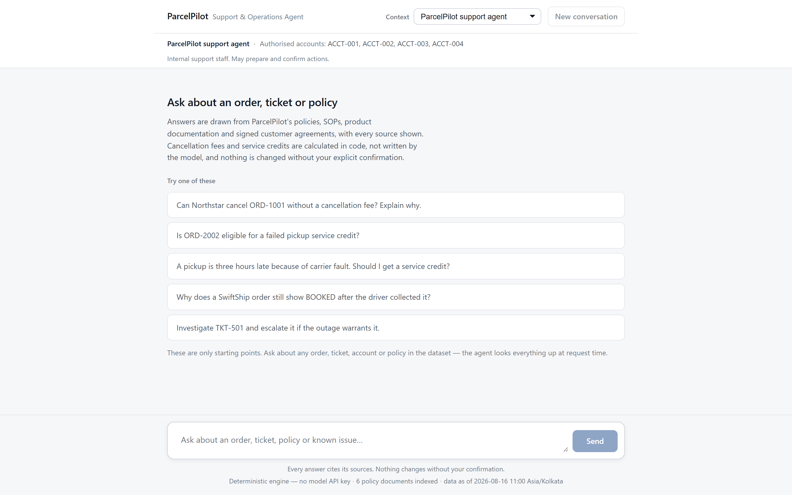 | 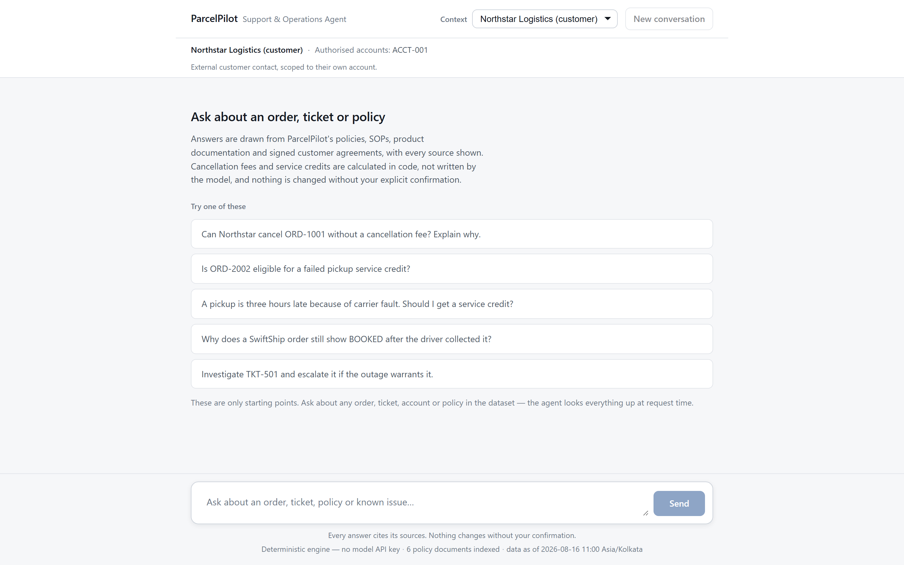 |
| **The whole product is one screen.** Header states who you are and which accounts you may reach; the composer sits below the transcript. No dashboard, no navigation. | **Switching context changes what you can see.** A customer contact is scoped to a single account, and the strip says so in full rather than implying it. |

### Contract-Aware Reasoning

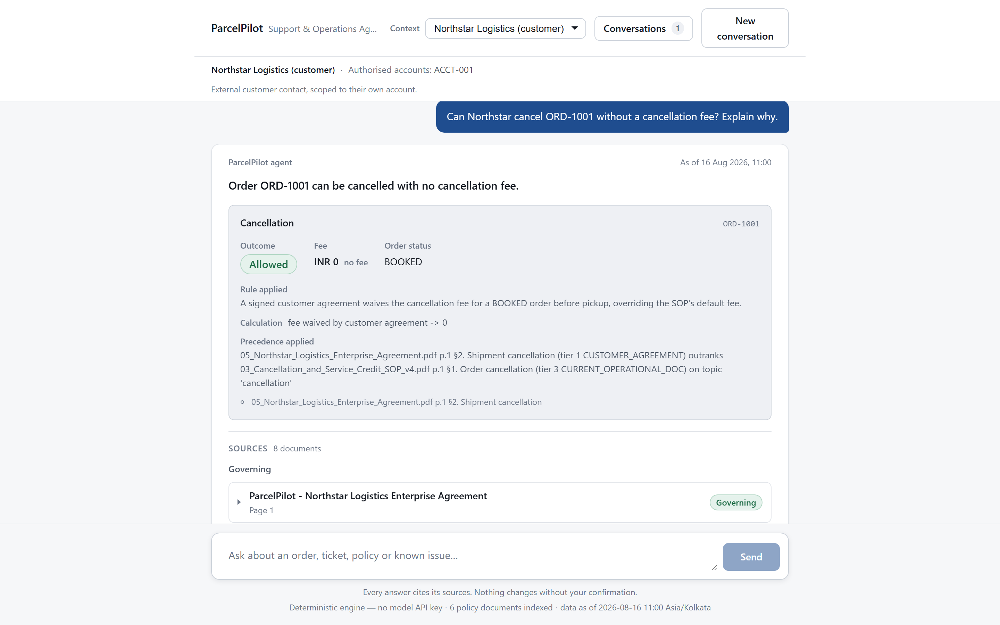

**A signed agreement outranks the standard SOP.** ORD-1001 would normally attract the SOP's cancellation fee. Northstar's enterprise agreement waives it, so the verdict reads *Allowed · INR 0 · no fee*, and the card names the winning source, the losing source and the topic the precedence applied to.

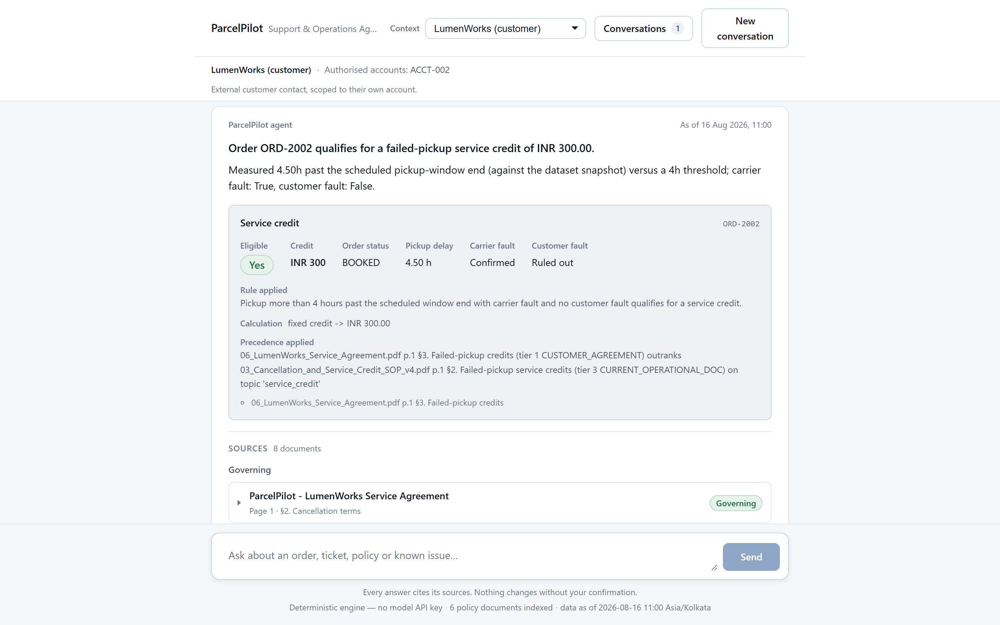

**The same mechanism, a different customer, a different number.** LumenWorks' agreement replaces the SOP's *INR 500 past 2 hours* default with *INR 300 past 4 hours*. The measured delay and the fault inputs the verdict rested on are shown beside it.

| | |
| --- | --- |
|  | 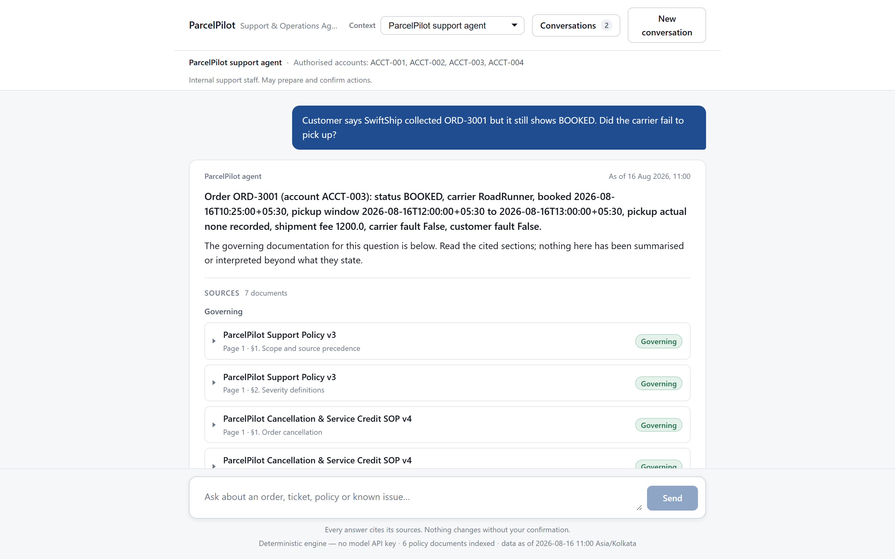 |
| **A breached first-response target.** The agreement's 15-minute P1 target overrides the plan default, and elapsed time is measured against the dataset snapshot rather than today's date. | **A documented known issue instead of a guess.** A `BOOKED` order after collection matches KI-211's pickup-webhook delay, so the agent cites the issue rather than asserting the carrier failed. |

### Security and Actions

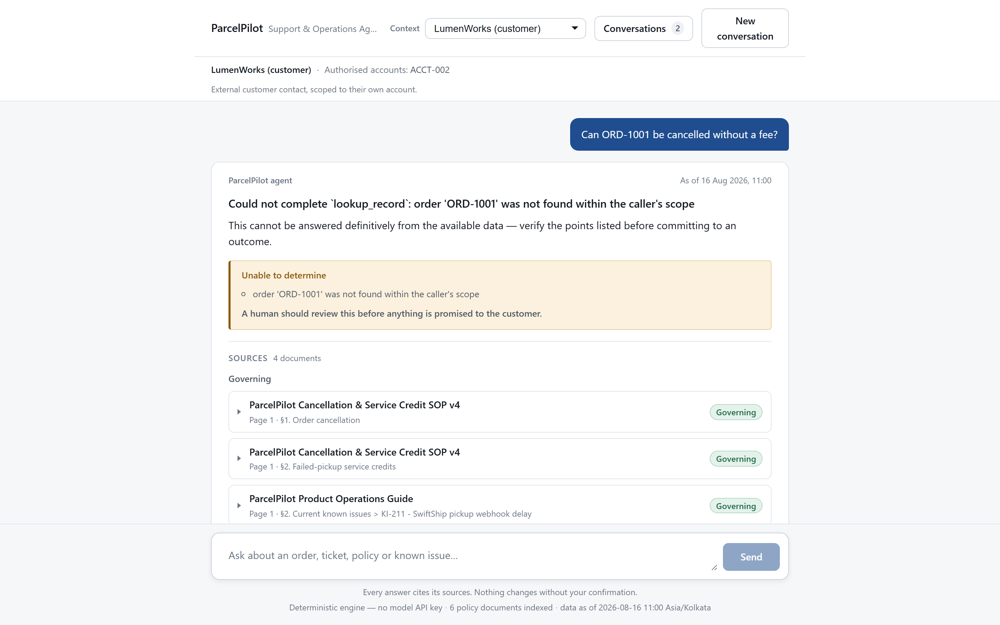

**Authorisation is enforced in the data layer, not the prompt.** A LumenWorks contact asking about a Northstar order is refused by the lookup tool itself — the record is reported as outside the caller's scope, and no cross-account detail reaches the answer.

| | |
| --- | --- |
| 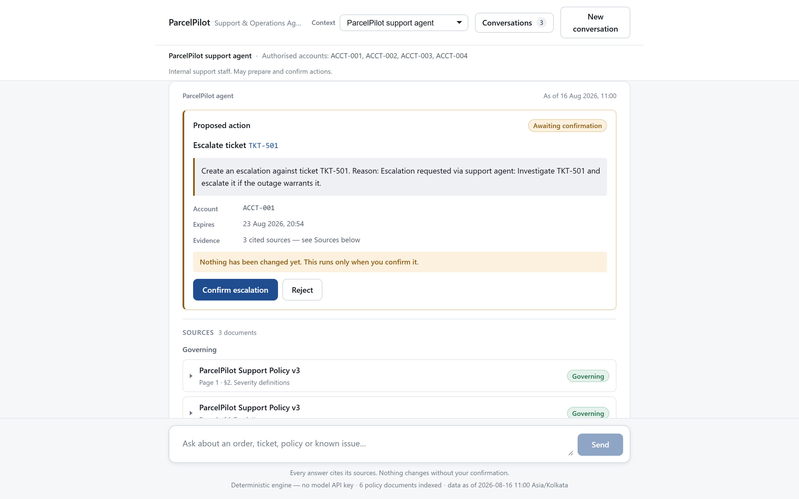 | 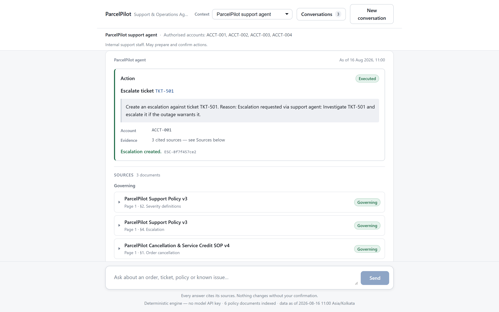 |
| **Nothing runs until a human says so.** The agent prepares the escalation, states in words that nothing has changed yet, and shows exactly what will happen along with when the proposal expires. | **Executed only after explicit confirmation**, with the resulting escalation id returned as a receipt. A replayed confirmation is refused. |

### Conversation Management

Each account context keeps its own conversations. Switching context never destroys them, and a customer can never reach another customer's history.

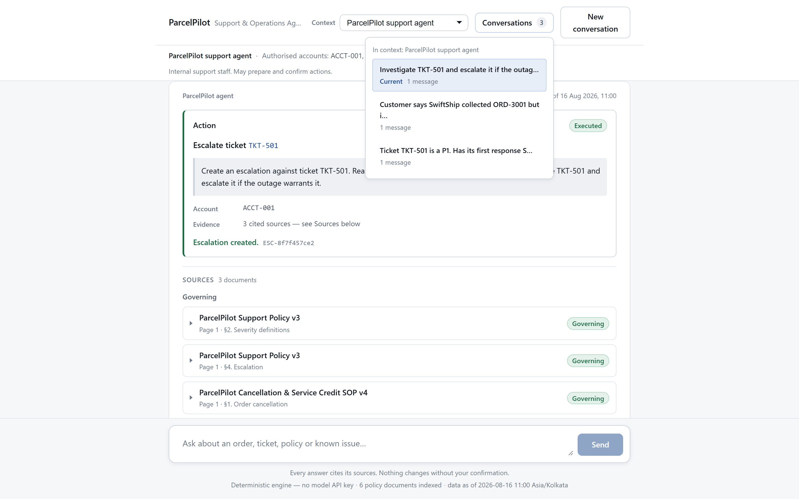

**Browsing previous conversations.** The *Conversations* panel lists every thread belonging to the context currently selected, labelled by its opening question and marked with which one is current. *New conversation* starts a fresh thread without discarding the old ones.

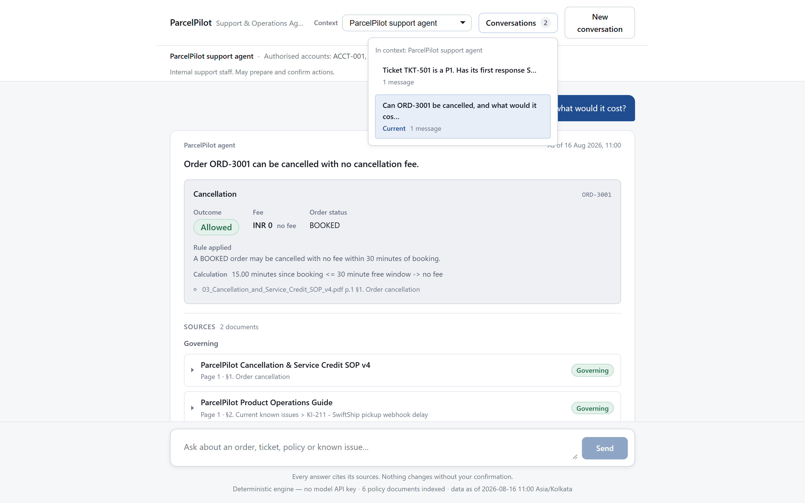

**Restoring one.** Selecting an earlier conversation brings its full transcript back — questions, decision cards and evidence — and marks it as current.

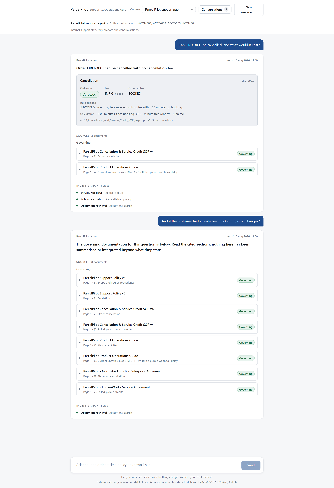

**Continuing it.** A restored conversation is live, not an archive: the follow-up lands in the same thread, beneath the original exchange, and the thread count is unchanged.

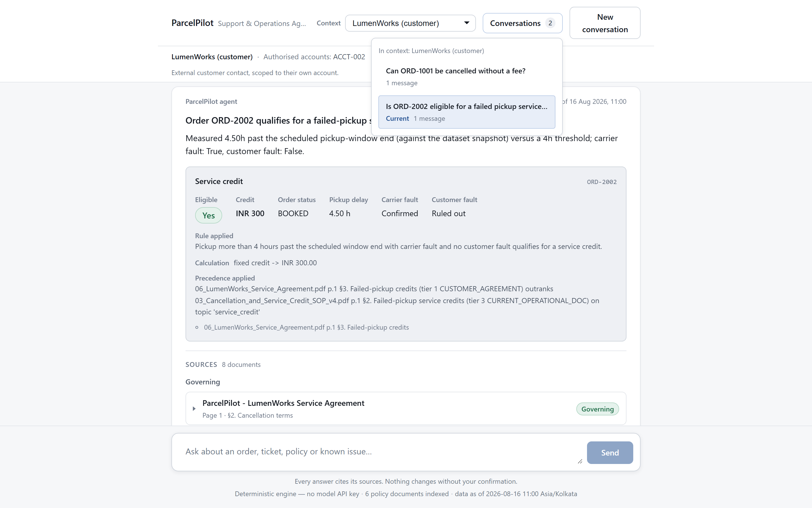

**Separate history per customer.** The LumenWorks context sees only conversations held as LumenWorks. Threads are stored per identity rather than in one shared list the interface filters, so there is no code path on which one customer's transcript reaches another.

### Agent Transparency

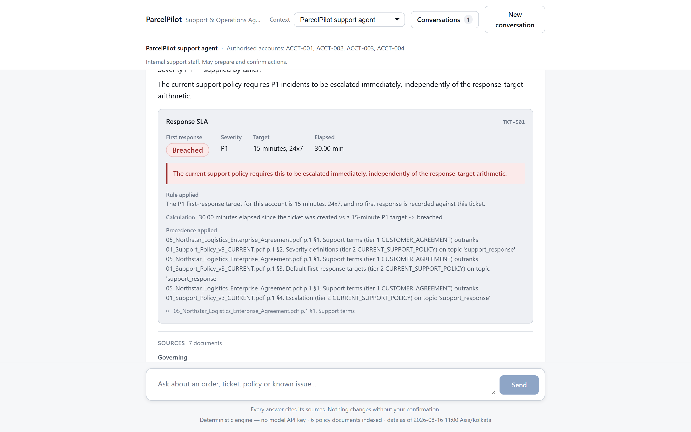

**What the agent actually did.** Every answer reports the capabilities it used — structured lookup, policy calculation, document retrieval — with its real step count. Sources are split into what governed the answer and what was outranked or superseded, so deprecated material stays visible without ever being mistaken for current policy.

## Assessment context

Built for the ParcelPilot AI Engineer assessment. The system must support:

| Capability | Notes |
| --- | --- |
| Natural-language Q&A | Free-form questions from support staff |
| Document retrieval | Over the supplied policy/SOP/agreement pack |
| Account / order / ticket lookup | Structured operational records |
| Deterministic policy calculation | SLA targets and breach, cancellation fees, service credits |
| Customer-agreement precedence | Signed agreements override general policy |
| SLA reasoning | Plan and agreement first-response targets, breach detection, P1 escalation |
| Known-issue reasoning | Match a symptom to a documented known issue |
| Multi-step tool use | Chain retrieval → lookup → calculation |
| Role/account-based access control | Enforced in code, never by prompt |
| Action preparation + confirmation | Nothing mutates without explicit approval |
| Escalation | Declare uncertainty rather than guess |
| Proactive issue detection | Surface risks the user did not ask about |

### Required agent tools

At minimum three distinct tools, all in `app/backend/tools/` — the first three
categories shipped in Phase 4; `evaluate_sla` was added in Phase 7:

1. **Document search / retrieval** — `search_documents`, `get_document_evidence`;
   authority-ranked search over the source pack.
2. **Structured lookup + calculation** — `lookup_record` for records, plus
   `evaluate_cancellation` / `evaluate_service_credit` (Phase 4) and
   `evaluate_sla` (Phase 7) for deterministic rule evaluation.
3. **State-changing action** — `prepare_escalation` / `prepare_ticket_note`
   produce a proposal; execution happens only via an explicit confirmation
   call that no tool can reach — `POST /api/actions/{id}/confirm`.

## Architecture principle

A hard split, enforced by module boundaries:

**The LLM handles** natural-language understanding, tool selection, multi-step
orchestration, reasoning over retrieved evidence, explanation, and deciding when
it is uncertain enough to escalate.

**Deterministic Python handles** authorization, account scoping, source
precedence, cancellation calculation, service-credit calculation, validation,
and every state change.

Phase 5 put a real OpenAI-backed provider behind the `PlanningProvider` seam
Phase 4 defined, without changing the orchestrator, the tools, or the policy
engine. The deterministic planner remains a first-class supported mode — it is
what CI and the whole test suite run on, so every safety boundary stays
verifiable with no API key and no network. Swapping the provider changes which
tools get called, not what any of them are permitted to do; a test asserts
both implementations satisfy the same seam signature.

The model never computes a number that a customer would see on an invoice, and
never decides whether a user is allowed to see a record. Those paths are code,
and they are unit-testable without an API key.

## Source authority

The supplied pack deliberately contains contradictions: a current policy and a
deprecated one, customer-specific agreements that override general terms, and
historical ticket resolutions that may simply be wrong. Every retrieved chunk
carries an authority tier, and conflicts resolve top-down:

```text
1. Active signed customer agreement       (highest — customer-scoped)
2. Current support policy / SOP / product documentation
3. Structured operational facts           (accounts, orders, tickets, SLAs)
4. Historical tickets & internal notes    (context only — never authority)
```

Rules (implemented for document sources in Phase 3 —
`app/backend/retrieval/authority.py`):

- A document marked deprecated is **never** cited as current policy. It may be
  surfaced only to explain that a rule changed.
- A customer agreement outranks general policy **only for that customer's**
  accounts — and only when the question names that account.
- A past ticket resolution is evidence of what someone did, not of what is
  correct. It cannot, on its own, justify an answer.
- When tiers genuinely conflict and precedence does not settle it, the agent
  says so and escalates.

Design detail lives in [docs/architecture.md](docs/architecture.md).

## What the engine refuses to decide

Three places where the deterministic layer returns "verify this" rather than a
figure. Each is a rule the supplied documents state, implemented literally.

**Severity is never inferred.** `evaluate_sla` computes a first-response target
and a breach, but it will not decide whether a ticket is P1, P2 or P3 — that is
a judgement about business impact, which the policy's severity definitions are
written for a person (or the model) to apply. Called without a `severity`, the
tool reports the elapsed time and every target it read, and asserts no breach.
An earlier draft scored ticket text against the severity definitions and picked
the best match; it rated a billing question P1 on one shared word and then
announced a breach against a 15-minute target, so it was removed. A confident
verdict resting on a guessed severity is the failure this system exists to
prevent.

**Business-hours targets are reported, not converted.** The corpus states
targets like "4 business hours" but defines no business calendar anywhere.
Converting one into a deadline would invent the calendar and the breach verdict
together, so those targets come back with the arithmetic explicitly unresolved.

**Unknown inputs stop a credit.** The SOP's "do not promise a credit when
carrier fault, pickup timing, or customer fault is unknown" is enforced as
written. What it does *not* do is treat an unconfirmed pickup as doubt in its
own right: a documented webhook lag is matched against the order's own carrier
and its stated window, so one carrier's known issue cannot withhold a credit a
signed agreement grants on another carrier's shipment.

## Planned technology stack

| Layer | Choice | Notes |
| --- | --- | --- |
| Frontend | Next.js 16 + React 19 + TypeScript | App Router; chat UI with citations, tool activity and confirmation cards — **built, Phase 6** |
| Backend | Python 3.13 + FastAPI | Typed request/response models — **built, Phase 5** |
| Database | SQLite (stdlib `sqlite3`) | Regenerated from the source pack; lives in `data/processed/` — **built, Phase 2** |
| PDF parsing | PyMuPDF | Font-size-aware section detection + page numbers for citation — **built, Phase 3** |
| Excel parsing | openpyxl | Loading `ParcelPilot_Assessment_Data.xlsx` — see Known environment notes on `pandas` |
| Validation | Pydantic v2 | Tool arguments, API contracts, config — **in use, Phase 2/3**: typed record and evidence models |
| Retrieval | BM25 over SQLite, in-process | **Built, Phase 3.** 26 chunks; no vector store or FTS5 index — see architecture §8.5 |
| LLM | Provider-neutral seam (`PlanningProvider`) | **Phase 4** deterministic planner + **Phase 5** OpenAI provider; selected by `LLM_PROVIDER` |
| Frontend styling | CSS Modules + custom properties | No UI framework; design tokens in `src/app/globals.css` — **built, Phase 6** |
| Tests | pytest + Vitest | Policy math, access control and UI rendering, all without live LLM calls |

Every row is implemented as of Phase 6. Backend versions are pinned in
[`requirements.txt`](requirements.txt), frontend versions in
[`app/frontend/package.json`](app/frontend/package.json).

## Local development prerequisites

Verified present on the development machine:

- **Python 3.13** — `py -3.13 --version`. (3.14 is the system default here but
  3.13 is the pinned target; see [Known environment notes](#known-environment-notes).)
- **Node.js 24.11.0** and **npm 11.6.1** — `node --version`
- **Git 2.51.2** — `git --version`

Optional / not currently installed:

- **GitHub CLI (`gh`)** — needed only to create the remote from the terminal.
- **Docker** — verified working (Phase 8): both images build cleanly, the
  compose stack starts, and `/health` responds. Not required for local
  development — the whole stack also runs natively — but is the path to
  [Deployment](#deployment).

## Setup

### The short version

One terminal, no API key, no network:

```powershell
py -3.13 -m venv .venv; .venv\Scripts\Activate.ps1
pip install -r requirements.txt
cd app/frontend; npm install; cd ../..
python scripts\ingest_dataset.py; python scripts\ingest_documents.py

python dev.py            # starts BOTH services
```

`dev.py` starts the API on <http://127.0.0.1:8000> and the UI on
<http://localhost:3000>, prefixes each log line with the service it came from,
and stops both on a single Ctrl+C. It refuses to start — with a specific
message — if a port is taken or `npm install` has not been run, rather than
failing halfway up. It uses the repository's own `.venv` whether or not the
environment is activated.

Open <http://localhost:3000>, pick a context in the **Acting as** panel beside
the transcript, and ask something.

Running the two services separately still works exactly as before, and is
still the right choice when you want to restart one without the other:

```powershell
# Terminal 1 — API
uvicorn app.backend.main:app --reload            # http://127.0.0.1:8000

# Terminal 2 — UI
cd app/frontend; npm run dev                     # http://localhost:3000
```

The full walkthrough is below.

### Build the data and run the tests — Windows, PowerShell, Python 3.13

Steps 1–7 need **no API key and no network**. The agent runs on the
deterministic planner by default, so the whole stack works offline and every
test is reproducible.

```powershell
# 1. Create/activate the venv (Python 3.13 pinned; see Known environment notes)
py -3.13 -m venv .venv
.venv\Scripts\Activate.ps1

# 2. Install dependencies
pip install -r requirements.txt

# 3. Place the supplied PDFs and XLSX in data/source/ — see data/source/README.md
#    Then verify the pack: presence, no unexpected files, readability, SHA-256
python scripts/verify_source_pack.py

# 4. Inspect PDF/XLSX structure; writes data/processed/source_inspection.json
python scripts/inspect_sources.py

# 5. Build the structured-data layer: creates/refreshes
#    data/processed/parcelpilot.db from the workbook. Safe to re-run --
#    each run wipes and reloads the data tables from the current workbook.
python scripts/ingest_dataset.py

# 6. Build the document/evidence layer from the six PDFs into the same
#    database. Also safe to re-run, and order-independent with step 5 --
#    the two scripts write disjoint tables and never clobber each other.
python scripts/ingest_documents.py

# 7. Run the full test suite (Phases 1-5)
python -m pytest tests/ -v

# 8. Start the API
uvicorn app.backend.main:app --reload --port 8000
```

`http://127.0.0.1:8000/docs` serves the generated OpenAPI documentation.

Both ingestion steps write into the same SQLite file and can be run in either
order, repeatedly. Step 6 is required before the agent can answer policy
questions, since precedence is resolved from the ingested documents.

Equivalent commands from Git Bash / WSL (`source .venv/Scripts/activate`
instead of `.venv\Scripts\Activate.ps1`) work the same way.

> Note: if console output includes non-ASCII characters (e.g. from PDF text),
> set `$env:PYTHONIOENCODING = "utf-8"` first to avoid a `UnicodeEncodeError`
> on Windows' default cp1252 terminal encoding. Scripts always write their
> file output (JSON reports, the SQLite database) as UTF-8 regardless of this
> setting.

The generated database lives at `data/processed/parcelpilot.db`. It is
git-ignored and fully regenerable — delete it and re-run steps 5 and 6 at any
time; nothing outside `data/processed/` depends on its prior contents.

- [Structured-data layer](docs/architecture.md#7-structured-data-layer-phase-2)
  — schema, timestamp handling, provenance.
- [Document / evidence layer](docs/architecture.md#8-document--evidence-layer-phase-3)
  — chunking, source authority, conflict resolution, account scoping.
- [Agent, tools and actions](docs/architecture.md#9-agent-tools-and-actions-phase-4)
  — orchestration, tool boundaries, the deterministic policy engine, and the
  confirmation gate on state-changing actions.
- [Application API and real agent integration](docs/architecture.md#10-application-api-and-real-agent-integration-phase-5)
  — the FastAPI boundary, the authorization context, the provider abstraction
  and its two implementations, the tool loop, the response contract, the
  confirmation API, and error handling.

### Running with a real LLM (optional)

The deterministic planner is the default and needs no configuration. To run
the agent on a live model instead:

```powershell
cp .env.example .env
# then edit .env:
#   LLM_PROVIDER=real
#   OPENAI_API_KEY=sk-...your real key...
#   OPENAI_MODEL=gpt-4o

uvicorn app.backend.main:app --reload --port 8000
```

Selection is explicit and there is **no fallback**. `LLM_PROVIDER=real`
without a usable `OPENAI_API_KEY` fails at startup with a clear message rather
than quietly running the rule-based planner — an operator who asked for a live
model and silently got a different one would be shipping a different system
than they think. Confirm which mode is live with `GET /health`.

Nothing else changes: the tools, the policy engine, account scoping and the
confirmation gate are identical in both modes. The `openai` SDK is imported
lazily, so the application and the test suite run on a machine that never
installed it.

This is still local-only — your machine, your key, nobody else can reach it.
See [Deployment](#deployment) for what additionally changes (and what does
not) once this runs on a public host.

### Frontend — the chat UI

The UI is a pure client of the API above. It holds no database connection, no
secrets and no business rules, so it needs no configuration beyond the address
of the backend.

```powershell
cd app/frontend
npm install
npm run dev          # http://localhost:3000
```

Run the backend in a second terminal (`uvicorn app.backend.main:app --reload`).
The UI defaults to `http://127.0.0.1:8000`; point it elsewhere by copying
`app/frontend/.env.example` to `app/frontend/.env.local` and setting
`NEXT_PUBLIC_API_BASE_URL`. The backend's `CORS_ALLOW_ORIGINS` must include the
UI's origin — `http://localhost:3000` is allowed by default.

No API key is involved. With `LLM_PROVIDER` unset the agent runs on the
deterministic planner, and the entire UI — evidence, policy decisions,
uncertainty, the confirmation gate — is fully exercisable offline.

#### Using the demo contexts

The **Context** selector, in the panel beside the transcript, switches which identity the conversation runs
as. Its options come from `GET /api/principals`, so the browser can only assert
an identity the server already knows, and the strip beneath it always shows the
active role and the accounts that identity may reach.

| Context | Role | Sees | Can confirm actions |
| --- | --- | --- | --- |
| ParcelPilot support agent | `support_agent` | all accounts | yes |
| ParcelPilot support manager | `support_manager` | all accounts | yes |
| ParcelPilot support (read-only) | `read_only` | all accounts | no |
| Northstar Logistics (customer) | `customer` | ACCT-001 only | no |
| LumenWorks (customer) | `customer` | ACCT-002 only | no |

Switching context starts a new conversation: a session binds prepared actions,
and carrying one across an identity change would leave a proposal made under
one scope sitting in a conversation running under another.

To see account isolation, select **Northstar Logistics (customer)** and ask for
a LumenWorks order — the refusal comes from the backend's SQL-level scoping,
not from the UI hiding anything. The browser never sends an account scope at
all.

#### Frontend tests

```powershell
cd app/frontend
npm test             # Vitest, jsdom, no network and no API key
npm run typecheck
```

The UI tests render real recorded API responses. `scripts/export_ui_fixtures.py`
captures them from the live application, and `tests/test_frontend_contract.py`
fails the **backend** suite if any fixture — or the OpenAPI document the
frontend generates its TypeScript from — goes stale. Regenerate both after
changing an API schema:

```powershell
python scripts\export_openapi.py
python scripts\export_ui_fixtures.py
cd app/frontend; npm run generate:api
```

## Deployment

Two containers, one persistent volume — no queue, no cache, no managed
database. The whole dataset is a handful of rows across six documents;
anything heavier would be infrastructure the application does not need.

```text
Next.js frontend  --->  FastAPI backend  --->  SQLite (persistent volume)
     :3000                  :8000                     |
                                              --->  OpenAI API (LLM_PROVIDER=real)
```

`Dockerfile.backend` (repo root, build context = repo root — the app imports
as `app.backend.*` and needs `scripts/` and `data/source/`),
`app/frontend/Dockerfile` (context = `app/frontend/`), and
`docker-compose.yml` wire this together. Verified directly (Phase 8): both
images build cleanly, `docker compose up` reaches a healthy backend and a
serving frontend, a container restart against the same volume skips
re-ingestion and preserves data, CORS rejects an unlisted origin, and no
credential appears in any image layer or in `/health` under either provider
mode.

```powershell
docker compose up --build
#   frontend  http://localhost:3000
#   backend   http://localhost:8000  (docs at /docs, health at /health)
```

For `LLM_PROVIDER=real`, put `OPENAI_API_KEY` in a git-ignored `.env` next to
`docker-compose.yml` — compose reads it automatically. Never in a committed
file.

### Three distinct modes — do not conflate them

| | Local deterministic demo | Local real-LLM mode | Production deployment |
| --- | --- | --- | --- |
| How to run | `uvicorn` + `npm run dev` natively, or `docker compose up` with `LLM_PROVIDER` unset | Same, with `LLM_PROVIDER=real` and a real `OPENAI_API_KEY` in `.env` | `docker compose up --build` (or the two images hosted separately) on a real host, real domain, real `OPENAI_API_KEY` if using `real` |
| API key / network | None. Fully offline. | Yes — calls the live OpenAI API | Yes, if `LLM_PROVIDER=real` |
| Authentication | `AUTH_MODE=demo_header` — the persona picker, no credential | Same, unless you set `AUTH_MODE=session` | **`AUTH_MODE=session`** — real accounts, scrypt passwords, server-side sessions, optional TOTP, workspaces. The demo header is refused when `APP_ENV` is production. |
| Who should reach it | Only you, on your machine | Only you, on your machine | Anyone who can reach the port — treat as public the moment it is |
| What it proves | Every safety boundary (scoping, precedence, confirmation gate), with no key and no network | The same boundaries, plus real natural-language planning | The same application the two demo modes already exercised, not a different one |

The deterministic planner is not a stub kept around for convenience — it is
what the entire test suite runs on, and it is what makes every boundary in
this system verifiable with no API key. Switching `LLM_PROVIDER` changes which
tools get called; it changes nothing about what any tool is permitted to do.

### Before deploying this publicly: choose the right AUTH_MODE

This matters more once the API is reachable from outside your machine than it
does in local development, so it is repeated here rather than left only in
[Identity](#identity).

ParcelPilot has two identity modes, and the default is the safe one.

**`AUTH_MODE=session` (the default).** Real authentication: accounts with
scrypt-hashed passwords, email verification, opaque server-side sessions in an
`HttpOnly` cookie, optional TOTP two-factor, password reset, brute-force
lockout, and workspaces with role-based access control. Nothing is asserted by
the client; identity, workspace, role and tenant scope are all read from the
database. This is what a deployment should run, and it is what the security
suites are written against.

**`AUTH_MODE=demo_header` (opt-in, non-production only).** The original
assessment behaviour, kept because the hosted demo needs to switch between
personas without a login. A request identifies itself by putting a plain string
— `support.agent`, `customer.northstar` — in `user_id` or the
`X-ParcelPilot-User` header, and the server looks it up in a fixed in-code
directory. **There is no credential check: anyone who can reach the API can
call it as any persona.** That is acceptable for a public demo over synthetic
data and unacceptable for anything else, so `Settings.validate_auth` refuses to
start in this mode when `APP_ENV` names a production environment, and `/health`
reports the active mode so a misconfigured deployment is visible from outside.

`GET /api/principals` lists the demo directory unauthenticated, which the demo
UI needs before any persona is chosen. Under `AUTH_MODE=session` it returns an
empty list — the directory is not an identity source there, and advertising it
would offer a sign-in that does not exist.

What is real in **both** modes, and never depended on which one is active: once
an identity is established, its workspace scope and role are enforced in SQL
below the model. Nothing in a message, a document, or a tool argument can
widen them. That boundary was built to be independent of how identity is
established — which is why Phase 0 could replace the acceptance step and Phase
1 could add workspaces without changing anything that consumes `AgentContext`.

**Before a real deployment**, in addition to `AUTH_MODE=session`: set
`APP_ENV=production`, keep `SESSION_COOKIE_SECURE=true`, serve over TLS with
`HSTS_ENABLED=true`, list your real origins in `CORS_ALLOW_ORIGINS` (a wildcard
is refused at startup), and create the first workspace with
`scripts/bootstrap_workspace.py`. Note that there is no mail transport, so
verification, reset and invitation links must be conveyed out of band — see
[docs/SECURITY.md](docs/SECURITY.md) for the full list of what is and is not
solved.

### The database is never baked into the image

`docker-entrypoint.sh` runs `ingest_dataset.py` + `ingest_documents.py` on
container start *only if* the database file is not already present at the
mounted volume path — so a fresh deployment always builds correctly from
`data/source/` alone, and a restart of an existing deployment does not
silently wipe an in-progress demo's confirmed actions. The deployed backend
never depends on a database file that exists only on a developer's machine.

The entrypoint derives that path from `DATABASE_URL` (Phase 8: previously it
checked a separate, unset variable and happened to agree with the
application's own default only because nobody had customised either one —
fixed so both the ingestion-skip check and the running application are
guaranteed to agree on one file, not two independently-defaulted paths).
Passed through `docker-compose.yml`; override it there if you relocate the
volume, and keep it under the `/app/data/processed` mount or it will not
persist across restarts.

### `NEXT_PUBLIC_API_BASE_URL` is a build-time value

Next.js inlines every `NEXT_PUBLIC_*` variable into the compiled client
JavaScript at `next build`. Setting it with `docker run -e` (or an
environment variable on an already-built image) has **no effect** — the
browser bundle was already written. Rebuild the frontend image for each
backend URL you deploy against:

```powershell
docker compose build --build-arg NEXT_PUBLIC_API_BASE_URL=https://api.example.com frontend
```

This was verified directly: building with an overridden value greps back out
of the compiled `.next/static/chunks/*.js`, and setting the same variable
afterward on a running container changes nothing.

### What is not included

No CI workflow and no platform-specific config (Vercel/Render/Railway/Fly)
exist *in this repository*. The [live deployment](#live-deployment) is
configured in the Vercel and Render dashboards rather than by committed files,
so nothing here is coupled to a particular host; Docker Compose remains the
portable baseline any of them can build from. SQLite plus a single volume
implies single-writer semantics, which is correct for a demo and would need
reconsideration before scaling to multiple backend instances.

## Operations intelligence

A reactive assistant only helps once someone thinks to ask. The **Operations**
view answers the question nobody had to type:

> What needs my attention right now, and why?

It reads the tickets and orders already in your workspace and produces a ranked
list of concerns, each one explained from the records behind it.

### What it detects

| | |
| --- | --- |
| **SLA risk** | A ticket with no first response, measured against the first-response targets that actually govern that account — including a signed customer agreement's tighter ones |
| **Recurring issues** | The same problem reported more than once by one customer |
| **Cross-customer issues** | One problem visible across several accounts, or a carrier missing pickup windows for more than one — the signal that turns a support ticket into an operations concern |
| **Unusual patterns** | Pickup windows closed with no pickup recorded; a concentration of cancellation requests |

Where a detected cluster matches documented material — a known issue in the
product operations guide — the signal says so. That is *correlation*, not
detection: the problem is found in your ticket data first, and the
documentation is then searched for it. Keying detection off a list of known
issue ids would only ever find problems somebody had already written down.

### It is deterministic, and it says how

Every signal is produced by a rule you can check, not by a model. The priority
is additive and fully itemised, so "why is this above that one?" has an answer:

```text
+40  severity           detector severity is critical
 +2  affected_records   1 ticket(s), 0 order(s)
+15  signal_type        sla_risk needs faster handling
 -5  documented         matches 3 documented section(s), so it is already understood
---
 52  total
```

Two rules shape the order. **Breadth amplifies severity but cannot substitute
for it** — a low-severity observation spread across many accounts never
displaces a genuine breach. And **confidence lowers priority, never raises it**
— an unverified concern cannot outrank a confirmed one.

### It does not overclaim

Severity is a judgement about business impact, so the system will not invent
one. A ticket past its tightest target but inside its widest is reported as
*breached if it is P1, and within target otherwise* — not as a breach.

Clustering compares words, which is imprecise on two-sentence tickets. Rather
than raise the bar until false positives disappear, a weakly-evidenced cluster
is still reported and marked **conditional**, with the shared terms named so
you can check it in seconds. A missed recurrence is worse than one you glance
at.

### Investigating

Any signal can be handed to the assistant, which fetches it through a tool and
answers with the same trust semantics as everywhere else. A recommendation is
advice: nothing acts on it. Escalating still goes through the ordinary
confirmation gate — propose, review, confirm.

### Access

Every workspace role can read signals, because a signal aggregates tickets and
orders those roles can already read individually. Acting on one still requires
the action permissions. Signals never cross a workspace boundary: the scope is
compiled into the query, and a signal id from another workspace is reported as
absent rather than forbidden.

**Detection runs when you ask for it.** There is no scheduler, no background
job and no notification — this is on-demand analysis of the data in your
workspace, not live monitoring.

## Workspaces and access control

ParcelPilot is multi-tenant. A person signs in as a **user**, and reaches data
through a **membership** of a **workspace**:

```text
User
 ├── Membership -> Workspace A   (role: Owner)
 ├── Membership -> Workspace B   (role: Operations)
 └── Membership -> Workspace C   (role: Viewer)
```

Everything the assistant can reach belongs to a workspace: accounts, orders,
tickets, documents, conversations, prepared actions, and the audit trail. The
same person can hold a different role in each one.

### Roles

| Role | Can do |
| --- | --- |
| **Viewer** | Ask questions, read evidence and the member list |
| **Support** | The above, plus *draft* actions for someone else to confirm |
| **Operations** | The above, plus confirm and execute actions, and read the audit trail |
| **Admin** | The above, plus invite, remove and re-role members, and rename the workspace |
| **Owner** | The above, plus transfer ownership |

Two splits are deliberate. **Drafting and executing are separate**, so a support
user can prepare an escalation that only someone with operational authority can
confirm — which is what makes the confirmation gate an approval rather than a
formality. And **inviting, removing and re-roling are separate permissions**,
so the ability to add someone does not imply the ability to remove them.

### How isolation is enforced

The workspace a request acts in comes from the **server-side session**, never
from the request. There is no `workspace_id` field on a chat request, and
sending one is a 422 rather than a silently ignored field. Workspace-management
routes do name the workspace in the path — you may belong to several — but that
id is resolved to a membership row for the authenticated user on *every*
request, and a workspace you do not belong to answers `404`, identically to one
that does not exist.

Below that, nothing changed from earlier phases: the workspace's account scope
is compiled into the SQL `WHERE` clause, so another tenant's rows are never
loaded into the process at all.

### Inviting someone

An owner or admin invites by email and role. The invitation is a credential, so
it is treated like one: only a SHA-256 digest is stored, it is bound to the
invited address and checked against the accepting user's own, it expires, it can
be revoked, and it can be redeemed exactly once.

**There is no mail transport in this build.** The invitation link is returned in
the API response when `APP_ENV` is not production and withheld when it is — send
it yourself, and see [docs/SECURITY.md](docs/SECURITY.md) for where a mail
sender would attach.

### Creating the first workspace

A newly registered user belongs to no workspace and is shown an onboarding
screen. To attach the *ingested dataset* to a workspace — which is what makes
the demo data reachable — run:

```bash
python scripts/bootstrap_workspace.py --email you@example.com --name "Acme Logistics"
```

It never overwrites a password, never moves an account already claimed by
another workspace, and never deletes anything, so re-running it is safe. Dataset
accounts that belong to no workspace are visible to nobody, which is the safe
direction to fail in.

## API

Six endpoints. Full schemas at `/docs` once the server is running.

| Endpoint | Purpose |
| --- | --- |
| `GET /health` | Liveness, active provider mode, whether the data is built |
| `POST /api/chat` | One natural-language request; returns answer + evidence + decisions |
| `POST /api/actions/{action_id}/confirm` | Execute or reject a prepared action |
| `GET /api/actions/pending` | Proposals awaiting confirmation, within your scope |
| `GET /api/actions/{action_id}` | Audit record: state, timeline, effect |
| `GET /api/principals` | The mock identities this deployment accepts |

### Identity

Every request asserts an identity — `user_id` in the body, or the
`X-ParcelPilot-User` header. The **server** resolves it to a role and an
account scope; the request never states its own permissions, and nothing in
the message can widen them.

```text
customer.northstar    customer         ACCT-001 only
customer.lumenworks   customer         ACCT-002 only
support.agent         support_agent    every account; may prepare and confirm
support.manager       support_manager  every account; may prepare and confirm
support.readonly      read_only        every account; may not change any state
```

Authentication itself is a **mock** in this phase: there is no token and no
signature. What is real is the boundary — the server, never the request,
decides the scope, and enforcement lives in SQL below the model. Before
running this anywhere reachable by someone other than you, read
[Before deploying this publicly](#before-deploying-this-publicly-choose-the-right-auth_mode).

**`support_manager` currently grants nothing `support_agent` does not.** The
one authorization distinction the system enforces is whether a role may change
state at all, which separates both internal staff roles from `read_only` and
from customers. The manager role is modelled and carried through so a
manager-only capability has somewhere to attach; none exists yet. The SOP's
"any individual credit above INR 1,000 requires manager approval" is computed
and reported by the policy engine rather than enforced, because neither
state-changing action this system ships — create an escalation, add a ticket
note — issues a credit. Gating it would mean gating an action that does not
exist. See [docs/product.md](docs/product.md#roles-and-what-each-may-do).

### Ask a question

```bash
curl -X POST http://127.0.0.1:8000/api/chat \
  -H "Content-Type: application/json" \
  -H "X-ParcelPilot-User: support.agent" \
  -d '{"message": "Can Northstar cancel ORD-1001 without a cancellation fee?"}'
```

```jsonc
{
  "outcome": "answered",
  "answer": "Order ORD-1001 can be cancelled with no cancellation fee. Rule applied: ...",
  "sources": [
    { "source_file": "05_Northstar_Logistics_Enterprise_Agreement.pdf",
      "page": 1, "section": "2. Shipment cancellation",
      "is_authoritative": true, "excerpt": "..." }
  ],
  "tools_used": [
    { "step": 1, "tool_name": "lookup_record",         "status": "ok" },
    { "step": 2, "tool_name": "evaluate_cancellation", "status": "ok" },
    { "step": 3, "tool_name": "search_documents",      "status": "ok" }
  ],
  "policy_decisions": [
    { "decision_type": "cancellation", "outcome": "allowed",
      "amount": "0.00", "currency": "INR",
      "calculation": "fee waived by customer agreement -> 0",
      "controlling_rule": "...", "overrides": ["... outranks ..."] }
  ],
  "uncertainties": [],
  "action_status": "none",
  "reference_time": "2026-08-16T11:00:00+05:30",  // dataset snapshot, not today
  "session_id": "SES-...", "account_scope": ["ACCT-001", "..."]
}
```

Cross-account access is refused below the model. A customer scoped to
ACCT-001 asking about ACCT-002 gets the same "not found within your scope"
they would get for a record that does not exist — the API is not an existence
oracle for other customers' data.

### Prepare and confirm an action

`POST /api/chat` can prepare a state change and nothing more; the response
comes back `action_status: "pending_confirmation"` with a preview and an
`action_id`. Execution is a separate call with a closed vocabulary
(`approve` / `reject`) — typing "okay" into the chat endpoint confirms
nothing, because that endpoint has no execution path at all.

```bash
curl -X POST http://127.0.0.1:8000/api/actions/ACT-abc123/confirm \
  -H "Content-Type: application/json" \
  -d '{"decision": "approve",
       "user_id": "support.manager",
       "session_id": "SES-...",
       "expected_fingerprint": "..."}'
```

Confirmation re-validates under the *confirming* caller: the action must exist
in their account scope, belong to that conversation, still be pending, not
have expired, still have a live target, and — when `expected_fingerprint` is
supplied — still describe exactly what was reviewed. It executes exactly once;
a replay returns `409 action_not_pending`.

### Errors

Every failure returns one envelope with a stable code — never a stack trace,
a SQL fragment, or a configuration value.

```json
{"error": {"code": "action_not_pending", "message": "...", "details": {}, "request_id": "REQ-..."}}
```

`validation_error` (422) · `unauthenticated` (401) · `forbidden` (403) ·
`not_found` (404) · `action_not_pending` / `action_session_mismatch` (409) ·
`provider_not_configured` / `data_unavailable` (503) · `provider_error` (502) ·
`provider_timeout` (504) · `internal_error` (500).

## Environment variables

Full template with defaults: [`.env.example`](.env.example). Copy it to `.env`;
`.env` is git-ignored and must never be committed. Every value has a working
default — **no `.env` is required** to run in deterministic mode.

| Variable | Purpose |
| --- | --- |
| `LLM_PROVIDER` | `deterministic` (default, no key) or `real`. No fallback between them. |
| `OPENAI_API_KEY` | Required only when `LLM_PROVIDER=real`. |
| `OPENAI_MODEL` / `OPENAI_BASE_URL` | Chat model; base URL for a compatible gateway |
| `AGENT_MAX_TOOL_STEPS` | Caps the orchestration loop |
| `AGENT_REQUEST_TIMEOUT_SECONDS` / `LLM_TEMPERATURE` | Provider call tuning |
| `DATABASE_URL` | SQLite path (under `data/processed/`). Read by the application *and* by `docker-entrypoint.sh`'s ingestion-skip check — the same value, so they cannot disagree about where the database lives. |
| `APP_ENV` / `CORS_ALLOW_ORIGINS` | Environment label; browser origins allowed to call the API |
| `AUTH_SECRET_KEY` / `AUTH_TOKEN_TTL_MINUTES` | Reserved for the real identity provider; unused today |
| `ENABLE_STATE_CHANGING_ACTIONS` | Kill switch: unregisters the preparation tools *and* closes the confirm endpoint |
| `NEXT_PUBLIC_API_BASE_URL` | Frontend → backend base URL. Set in `app/frontend/.env.local`, not in the backend `.env` — it is a browser-visible value and must never hold a secret. |

## Project layout

```text
.
├── app/
│   ├── frontend/            # Next.js + TypeScript chat UI
│   │   ├── openapi.json     # Exported backend contract (generated)
│   │   └── src/
│   │       ├── app/         # App Router: layout, chat page, design tokens
│   │       ├── components/  # Header, composer, evidence, decisions, action card
│   │       ├── hooks/       # useConversation — session, turns, confirmation
│   │       ├── lib/         # client.ts, types.ts, presentation.ts, api-schema.d.ts
│   │       └── test/        # Recorded API fixtures + fetch stub
│   └── backend/
│       ├── main.py          # ASGI entry point: uvicorn app.backend.main:app
│       ├── api/             # app.py, routes.py, schemas.py, dependencies.py, errors.py
│       ├── agent/           # orchestrator.py, provider.py, openai_provider.py,
│       │                    #   factory.py, prompts.py, composer.py
│       ├── tools/           # Tool definitions exposed to the LLM
│       ├── policies/        # Deterministic rules: cancellation, credits, terms
│       ├── retrieval/       # extraction.py, authority.py, search.py
│       ├── auth/            # principals.py — mock identity → AgentContext
│       ├── services/        # database.py, records.py, documents.py, actions.py
│       ├── models/          # records, documents, policy, actions, agent (Pydantic)
│       └── core/            # config.py, errors.py
├── data/
│   ├── source/              # Supplied assessment pack (inputs — see its README)
│   ├── processed/           # Generated SQLite + extracted text (git-ignored)
│   └── index/               # Generated retrieval index (git-ignored)
├── scripts/                 # Ingestion, verification, DB build, contract export
├── tests/                   # pytest suite
├── docs/
│   ├── architecture.md      # Technical design
│   └── product.md           # Product behaviour and scope
├── .env.example
└── README.md
```

`data/processed/` and `data/index/` are fully regenerable from `data/source/`;
nothing in them is a source of truth.

## Implementation phases

| Phase | Scope | State |
| --- | --- | --- |
| **0** | Repo init, structure, tooling recon | **Done** |
| **1** | Source-pack verification; PDF/XLSX structural inspection | **Done** |
| **2** | SQLite schema + ingestion from source; deterministic record access | **Done** |
| **3** | Document ingestion, chunking, authority ranking, evidence retrieval | **Done** |
| **4** | Agent orchestration, tools, policy engine, confirmed actions | **Done** |
| **5** | FastAPI surface; mock auth context; real LLM provider; confirmation API | **Done** |
| **6** | Next.js UI: chat, citations, tool activity, confirmation cards | **Done** |
| **7** | Deterministic SLA targets/breach; assessment test matrix; adversarial pass | **Done** |
| **8** | Deployment configuration verified: both images build, compose stack runs end to end, `DATABASE_URL` consistency fixed, secrets/CORS/health audited | **Done** — hosting itself pending an actual platform/account |

Phase 5 absorbed what earlier planning had split across phases 5, 6 and 8:
the authorization hook the Phase 2/3 repositories already carried needed a
caller to supply it, and that caller is the API — so building the API,
the auth context and the live provider separately would have meant three
passes over the same seam.

## Known environment notes

- **Python 3.13 is pinned**, not the system-default 3.14. Both resolve the core
  dependencies, but 3.13 has broader wheel coverage across the retrieval stack.
  Create the venv with `py -3.13 -m venv .venv`.
- **This repository lives inside a OneDrive-synced folder.** Filesystem writes
  are noticeably slow and sync can interfere with `node_modules/` and open
  SQLite files. Consider excluding the folder from OneDrive sync, or relocating
  the repo outside OneDrive, before Phase 1.
- **`pandas` is deliberately not a dependency**, despite appearing in earlier
  planning. In this environment, `import pandas` hangs indefinitely (tested
  90s+ with no return) in the project's `.venv` — reproducible, not a fluke,
  suspected `pandas`/`numpy` version mismatch or OneDrive interference on
  first import. `openpyxl` alone fully covers XLSX reading for Phase 1 and 2
  (Phase 2 was also asked to avoid `pandas` explicitly), so it was dropped
  from `requirements.txt` rather than debugged. Revisit if a future phase
  has a concrete reason to need it.

## Think Beyond the Immediate Requirements

Everything below is **not implemented**. It is drawn directly from the
deferred decisions already recorded in
[docs/architecture.md §13](docs/architecture.md#13-deferred-decisions) and
[docs/product.md — Future work](docs/product.md#future-work), ordered by what
actually blocks the next thing from being safe or useful to build, not by
novelty. Each item names what existing ParcelPilot foundation it builds on,
because none of this is a rewrite — the module boundaries Phase 4–5 drew were
chosen so that this list could be additive.

### 1. Real authentication and production authorization

**What:** Replace `auth/principals.py`'s fixed identity directory with a real
identity provider — OAuth/OIDC, or signed API tokens issued out-of-band —
behind `resolve_principal` (`app/backend/api/dependencies.py`). `AUTH_SECRET_KEY`
and `AUTH_TOKEN_TTL_MINUTES` are already reserved in `.env.example` for exactly
this and are unused today.

**Why it's first:** The [live deployment](#live-deployment) is real, but
anyone who can reach it can call the API as `support.manager` — or any of the
other four identities — just by naming it in a header; no credential is
checked. That is documented, not hidden (see
[Before deploying this publicly](#before-deploying-this-publicly-choose-the-right-auth_mode)),
and it is the one gap that gates every other item on this list: none of them
are safe to point at real customer data while identity is still a
self-asserted string.

**What it solves:** Turns "the API only enforces scope for whoever it's told
you are" into "the API establishes who you are." Nothing else changes in
meaning — the scoping was already real.

**What already enables it:** This is the reason `AgentContext` exists as a
seam at all. Authorization — account scoping, source precedence, the
confirmation gate — is enforced entirely below the model, in SQL and in
`policies/`, and none of it reads how identity was established. Replacing
`auth/principals.py` with a real provider touches one module; retrieval,
policy evaluation and the action state machine need no change, which is the
point Phase 5's design was built around.

### 2. Durable conversation history and re-authorized memory

**What:** Persist prior turns per conversation and replay relevant history
into the tool-calling loop, so a follow-up question doesn't require the
support agent to restate context the system already has.

**Why it's second:** Today `POST /api/chat` issues and echoes a `session_id`
that binds *prepared actions* — that's session/action correlation, not model
memory. No prior turn is replayed; each request is investigated from scratch.
The frontend's own conversation list is a client-side transcript of past
responses, not evidence the backend remembers anything. Building this before
authentication is real would mean deciding how to re-authorize a stored turn
once identity is trustworthy — better to settle identity first, then decide
what a stored turn is allowed to carry forward.

**What it solves:** A support agent working a multi-message ticket
conversation currently has to re-supply context ("about ORD-1001 again...")
on every turn. Real memory removes that friction and lets follow-ups like
"and what if the pickup had already happened?" resolve against the actual
prior exchange instead of a fresh, context-free investigation.

**The hard part, stated plainly:** replaying history into a tool-calling loop
means a message from an earlier turn gets re-interpreted under whatever scope
is active *now*. If a conversation could ever cross an identity or account
boundary — a support agent later reopening a customer's thread, or a
session outliving a permission change — replaying it naively would leak
scope from one authorization context into another. The design has to bind
each stored turn to the scope it was authorized *under*, and re-check that
scope (not just replay the text) whenever the turn is loaded back in. That
retention-and-re-authorization story is exactly what Phase 5 didn't have a
reason to settle with mock auth in place — which is why this sits behind
item 1, not ahead of it.

**What already enables it:** The `session_id` correlation and the per-context
conversation storage the frontend already exercises (see
[Conversation Management](#conversation-management) above) are the shape this
extends — the boundary to add is authorization on *read*, not a new storage
model.

### 3. Proactive issue detection

**What:** A designed detector that surfaces a documented known issue against
a ticket's symptoms *before* an agent asks, flags other orders on the same
account likely affected by the same root cause, and surfaces SLA risk ahead
of breach — built as explainable, source-cited findings, not a generic
"anything interesting" feed.

**Why it's third:** It's genuinely additive — it needs no change to
retrieval, the record layer, or the policy engine, only a new pass over data
those layers already expose. It comes after memory rather than before it
because a detector that can say "this is the third ticket like this on this
account this week" is far more useful with durable history to look across
than with only the current request's investigation.

**What it solves:** Right now the system is entirely reactive — it answers
what's asked and does the defensive surfacing [product.md](docs/product.md)
already ships (monthly cap warnings, stale-pickup flags, P1 escalation
prompts), but there's no background scan and nothing volunteers an
observation the agent didn't ask about. A cluster of tickets citing the same
known issue, or a shipment failure pattern on one account, currently has to
be noticed by a human reading multiple tickets. A support agent under time
pressure is exactly the person least likely to spot a cross-ticket pattern
unprompted.

**The design constraint that matters:** every surfaced finding must trace to
a specific clause, record or known-issue document the same way the existing
defensive surfaces do — see
[docs/product.md — Defensive and proactive behaviour that ships](docs/product.md#defensive-and-proactive-behaviour-that-ships)
for the standard this has to meet. A general-purpose "surface anything
unusual" feature is explicitly the failure mode to avoid; it becomes noise an
agent learns to ignore, which is worse than not building it.

**What already enables it:** `search_documents`' known-issue matching, the
account-scoped `lookup_record` layer, and the tier/authority model in
`retrieval/authority.py` are the exact primitives a detector would run
against on a schedule instead of on request — no new data path, just a new
caller.

### 4. A credit-issuing action, with the manager-approval threshold enforced — **built**

**What shipped:** `issue_service_credit`, added through the same `prepare_*` →
confirm pipeline as `prepare_escalation` and `prepare_ticket_note`. A credit
above the SOP's threshold requires the *confirming* identity to hold
`approve_high_value_action` (granted from `admin` up), and the requirement is
re-derived from the policy engine at confirmation time rather than read from
the action row — so a role change between preparing and confirming is
respected, and a stale flag cannot buy a cheap approval.

The amount is never the caller's: `prepare_service_credit` refuses an `amount`
or `currency` argument outright and fills the parameters from the policy
engine's own decision.

It landed fourth for the reason given here — it is the item that makes the
manager role's distinction mean something, but money moves, so it belongs
after the trust foundation. See
[docs/architecture.md §17](docs/architecture.md#17-phase-5--accountable-actions).

**What enabled it:** the confirmation architecture, unchanged. The third action
type needed a `prepare_*` tool, one effect writer, and one authorization check
in `confirm_action`; the state machine, expiry, fingerprinting,
re-validation-at-confirm-time and single-use execution all carried over
untouched, which is what the first two action types existed to prove.

### 5. Auditability alongside authentication and authorization

**What:** As real authentication (item 1) lands, extend it with scoped
permissions per identity beyond today's flat "may/may not change state," and
a durable audit trail of who confirmed which action, when, and under what
preview — not just the `GET /api/actions/{id}` snapshot of one action's own
lifecycle that exists today.

**Why it's here:** This is explicitly the *evolution* of item 1, not a
separate initiative — authentication answers "who is this," authorization
answers "what may they do," and auditability answers "what did they actually
do." Building it as one undifferentiated "auth work" item would blur a
distinction the codebase already keeps clean: identity resolution, scope
enforcement, and action history are three different concerns living in three
different modules (`auth/`, the policy/scoping layer, and `services/actions.py`)
today, and they should stay that way as each one grows.

**What it solves:** `support_manager` and `support_agent` are identical in
capability today (see item 4) — real scoped permissions is what makes a
manager-only capability, once one exists, actually mean something at the
authorization layer rather than only in the SOP's text. A durable,
queryable audit trail turns "an action executed" into "an action executed,
attributably" — the difference that matters the moment a real credit or a
real escalation has a real customer on the other end of it.

**What already enables it:** Every action already carries a fingerprint,
an expiry, and a confirming-caller re-validation step
(see [Prepare and confirm an action](#prepare-and-confirm-an-action)) —
the state machine already produces the events an audit trail would record;
today they're just not persisted anywhere beyond the single action's own row.

### 6. Streaming agent investigation

**What:** Expose the orchestrator's actual tool-by-tool progress over SSE or
a websocket, so the UI's `AgentActivity` component fills in rows as
each tool call resolves, instead of rendering a completed investigation in
one shot after `POST /api/chat` returns.

**Why it's here rather than earlier:** It's a transport change, not a
re-architecture, and it's pure UX — nothing about correctness, safety or
scope depends on it. It sits behind the trust and usability items because a
demo that streams a self-asserted identity's investigation isn't more
trustworthy than one that doesn't; the ordering reflects that this is
polish once the substance is solid, not a substitute for it.

**What it solves:** The current UI is honest about this rather than faking
it — the tool-activity panel already renders every step the orchestrator
actually took, it's just rendered after the fact because the API answers in
one response. A multi-step investigation (document search → record lookup →
policy evaluation) can take a few real seconds; showing it live is a better
experience for exactly the reason a spinner is worse than a progress bar.

**What already enables it:** `AgentActivity` is already shaped to
receive incremental rows — the component doesn't need to change, only the
transport feeding it. The orchestration loop already emits a discrete event
per tool call internally (`tools_used[]` in today's response is built from
exactly those events, just collected instead of streamed); the work is
adding a streaming response path over the same loop, not changing what the
loop does.

### 7. Real-mode prose validation, and evaluation more broadly

**What:** In `LLM_PROVIDER=real`, assert that every monetary figure appearing
in the model-authored `answer` string also appears in the structured
`policy_decisions[]` returned beside it, and fall back to the deterministic
composer's prose when it does not. Alongside that: regression suites over
known policy-conflict cases, retrieval quality evaluation, authorization
tests that stay adversarial as new tools are added, and production
monitoring once this runs somewhere real.

**Why it's last:** It's the narrowest-scope, lowest-likelihood risk on this
list, and it only exists in `LLM_PROVIDER=real` — the deterministic planner,
which is the default and what the whole test suite runs on, has no such gap
by construction (`agent/composer.py` assembles prose from typed tool-result
fields, so it cannot disagree with the decision it describes). See
[docs/architecture.md §10.12](docs/architecture.md#1012-what-authority-the-models-prose-carries)
for the full statement of this residual risk and why a half-tuned validator
would be worse than the documented gap it replaced.

**What it solves:** In real mode, the model writes the answer's prose, and a
prompt is an instruction, not an enforcement mechanism — in principle a
transcription slip or an over-confident paraphrase could put a figure in the
prose that doesn't match the decision beside it. Today nothing detects that
specific case, though authorization, scoping, precedence and the
confirmation gate are all completely unaffected by it, since none of them
read the answer string. Validation closes the one gap that's specific to
prose, and a real evaluation suite is what turns "we believe this still
holds" into something measured every time a tool, a document, or a policy
rule changes.

**What already enables it:** The seam this hardens already exists —
`policy_decisions[]` is already the authoritative, UI-rendered source of
truth, and the composer that would provide the deterministic fallback
already exists and already runs by default. Validation is a check inserted
at one point in `AgentOrchestrator.handle`, not new infrastructure.

### Technical trade-offs guiding this roadmap

None of the above changes the split this system was built around, and the
roadmap is ordered partly to protect it:

- **Deterministic business rules stay outside the model, always.** A
  credit-issuing action (item 4) is a new tool wrapping a new function in
  `policies/`, not a new prompt asking the model to compute an amount.
- **Authorization stays below the model.** Real auth (item 1) replaces how
  identity is *established*; it does not move the scope check into a prompt
  or a system message. The check that matters was never expressible as an
  instruction, and it still won't be.
- **Confirmation stays a structural execution boundary**, not a UI
  convention. A fourth action type gets the same two-call
  prepare-then-confirm shape as the first two, with the same
  expire/re-validate/single-use guarantees — never a shortcut that lets a
  new action execute on the strength of the model's own confidence.
- **No infrastructure gets added ahead of a reason to need it.** SQLite plus
  a single volume is correct for this dataset's size and implies
  single-writer semantics — that's a real limit worth naming, but it's a
  reason to reconsider *if and when* multiple backend instances are needed,
  not a reason to reach for a managed database now. The same discipline
  applies to every item above: streaming (item 6) is worth building the day
  a UI actually needs live progress, not before.
- **Streaming replaces the mechanism, not the honesty.** The alternative to
  building item 6 is simulating progress on top of a single-response API —
  rejected deliberately, because a progress indicator that doesn't reflect
  real tool execution is a worse UI decision than a plain "waiting" state.
- **Memory ships with a retention and re-authorization model, or it doesn't
  ship.** Item 2 is ordered behind item 1 specifically because replaying a
  transcript into a tool-calling loop without deciding what scope a stored
  turn carries would quietly reintroduce the exact class of cross-account
  leak Phase 7's adversarial pass tested for and found nothing on.
- **Proactive detection expands only as far as it stays explainable.** Item 3
  is scoped to findings that cite a specific document or record, the same
  bar the existing defensive surfaces meet — not because a broader "anything
  interesting" feature is harder to build, but because it would be actively
  worse than the reactive system it would replace.
